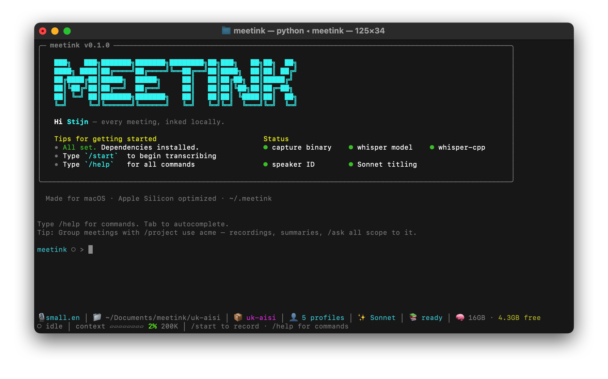

<p align="center">
  
</p>

# meetink

Local-first meeting transcription for the macOS terminal. Captures system audio (Zoom, Meet, Teams, anything that plays through the speakers) and your microphone simultaneously, runs them through `whisper.cpp` on-device, optionally identifies who is speaking, generates AI titles and summaries, and lets you ask questions about the meeting — all without sending a byte to the cloud.

> **Status:** v0.1.0 — Apple Silicon only. macOS 14 (Sonoma) or later.

```
[14:32:08] STIJN: yeah I think we should ship it next week
[14:32:14] ALICE: agreed, let's get the design review on the calendar
[14:32:21] BOB:   I can take action item on the marketing site
```

---

## Table of contents

- [Why](#why)
- [Highlights](#highlights)
- [Requirements](#requirements)
- [Install](#install)
- [Quick start](#quick-start)
- [The interactive REPL](#the-interactive-repl)
- [Slash commands reference](#slash-commands-reference)
- [Concepts](#concepts)
  - [Projects](#projects)
  - [Identity (`/me`)](#identity-me)
  - [Speaker identification (diarize + profiles)](#speaker-identification-diarize--profiles)
  - [`/watch` — auto-record from your calendar](#watch--auto-record-from-your-calendar)
  - [Local LLM (titling, summaries, /ask)](#local-llm-titling-summaries-ask)
  - [Context documents](#context-documents)
  - [Custom vocabulary](#custom-vocabulary)
- [Examples & recipes](#examples--recipes)
- [How it works](#how-it-works)
- [File layout on disk](#file-layout-on-disk)
- [Configuration & environment variables](#configuration--environment-variables)
- [Troubleshooting](#troubleshooting)
- [Limitations](#limitations)
- [Privacy](#privacy)
- [License & credits](#license--credits)

---

## Why

If you take a lot of meetings on your Mac and want a private transcript, you usually have three options: pay a cloud notetaker (your audio leaves your laptop), record locally and transcribe later (slow, manual), or roll your own ScreenCaptureKit pipeline. meetink is the third one, packaged.

- **No cloud.** Audio never leaves your machine. No API key, no account.
- **Works everywhere.** It listens to system audio + microphone, so any video conferencing tool, dialler, or browser tab works the same way.
- **One command.** `meetink start` records, `meetink stop` stops. Or just type `meetink` and use the REPL.
- **Apple Silicon first.** Whisper runs on Metal. The local LLM runs on Apple's MLX framework (Metal + ANE), 30–60 % faster than llama.cpp on M-series.

---

## Highlights

- **Live, labelled transcripts.** Two streams (mic / system audio), aggressively de-hallucinated, merged into readable lines, written to a per-session file.
- **AI titles and summaries.** Finished meetings are renamed `2026-05-07_14-32_design-review-followup.txt`, and a `<name>.summary.md` (Topics, Decisions, Action items, Open questions) is generated automatically. Backend is `local` (on-device Qwen3.5-4bit via MLX) or `claude` (your Claude Pro/Max subscription via the `claude` CLI).
- **`/ask` over the meeting.** Stream answers about the current or most-recent transcript, with project context and prior `/ask` turns automatically threaded in.
- **Auto-record from your calendar.** `/watch on` polls Calendar.app, fires a 1-minute notification before each event with a Skip button, then auto-starts recording at the scheduled time — and auto-stops within **~10 s** of the conferencing app going away (tightened browser URL regex + fast-confirm polling: the moment we see one inactive poll mid-recording the cadence drops from 30 s to 5 s and stop fires after one more). Catches impromptu calls too: a meeting that starts without a calendar event triggers a confirmation notification ~30 s in. State persists across REPL restarts.
- **Speaker identification, tunable per meeting.** Optional sidecar (sherpa-onnx + WeSpeaker) labels recurring voices by name once you've enrolled a `/profile`. Unknown voices get clustered live as `THEM-A`, `THEM-B`, … Three sensitivity presets (`focused` / `default` / `strict`) auto-applied from the calendar event's attendee count, plus a per-session **whitelist** that restricts matching to people who are actually in the room — so Mike's voice can never be misidentified as Alice in a 1:1 with Mike. When the whitelist narrows to one profile, a higher absolute floor kicks in to prevent the "the only candidate wins by default" failure mode.
- **Self-improving profiles, that keep getting better.** Four mechanisms compound: (1) high-confidence `/identify` matches fold back into the matched profile (auto-train, with a tightness-hysteresis pause that suspends auto-train on any profile whose samples have started spreading — catches runaway drift before it snowballs); (2) `/profile train <name>` mid-meeting adopts the most recent system-audio embedding from the call rather than re-recording your mic, so you can click "train Mike" right after Mike speaks and actually grab *his* voice; (3) each profile holds up to 3 k-means centroids so a person's *different voice modes* (different mic, mood, accent variation) all match their best mode instead of being averaged together; (4) time decay (180-day half-life) keeps the centroid tracking the speaker's current voice, not their voice from a year ago. Outlier rejection guards every sample-add path (`/enroll`, `/train`, `/assign`, `/rename`, auto-train) so one bad sample can't pollute a centroid. Recoverable per-sample via `/profile undo`; full diagnostic via `/profile diagnose <name>`.
- **Hot-swap mics mid-call.** Unplug your headphones, switch Bluetooth, pick a new mic in System Settings — the capture binary subscribes to `AVAudioEngineConfigurationChange` and rebuilds the tap on the new device without losing the recording. No more "I switched mics and my voice disappeared from the transcript."
- **Projects.** Group recordings, summaries, and reference docs by client / topic. `/ask` automatically pulls in past meetings and curated context for the active project.
- **Context documents.** `/context add report.pdf` converts any PDF / DOCX / XLSX / PPTX / MD into the project's reference set so the LLM can read it.
- **Native terminal UX.** `prompt_toolkit` REPL with tab completion, native scrollback, native text selection, native ⌘F. Live status footer with elapsed recording time and line count.

---

## Requirements

| | |
|---|---|
| **OS** | macOS 14 (Sonoma) or later |
| **CPU** | Apple Silicon (M1 / M2 / M3 / M4 …). Intel will not run the MLX features and is not supported. |
| **Disk** | ~2.2 GB for the default install (whisper `small.en` ~500 MB + Qwen3.5-2B-4bit ~1.2 GB + venv) |
| **Network** | Required for `setup` (downloads models). After that, fully offline unless you opt into the `claude` backend. |
| **Required tools** | Xcode Command Line Tools (`xcode-select --install`), [Homebrew](https://brew.sh), Python 3 (ships with macOS), [`uv`](https://github.com/astral-sh/uv) (auto-installed by `setup` if missing). |
| **Optional** | `claude` CLI (Claude Code) if you want the `claude` backend for titling / summaries / `/ask`. |

---

## Install

```sh
git clone https://github.com/sservaes/meetink.git
cd meetink
./bin/meetink setup
```

`setup` is idempotent and asks for a single confirmation up-front. It will:

1. Verify you're on Apple Silicon.
2. `brew install whisper-cpp` (or skip if already installed).
3. Download the whisper `small.en` GGML weights (~500 MB) and its CoreML companion (`.mlmodelc`) so the encoder runs on the Apple Neural Engine.
4. Build `meetink-capture` from `src/capture/Sources/main.swift` using the highest available `MacOSXNN.NN.sdk`, target `arm64-apple-macosx14.0`.
5. Provision a Python venv at `~/.meetink/py-venv` via `uv` and install `prompt_toolkit`, `mlx-lm`, `huggingface_hub`, `markitdown`.
6. Snapshot the default local LLM (`mlx-community/Qwen3.5-2B-4bit`, ~1.2 GB) into `~/.meetink/models/mlx/Qwen3.5-2B-4bit/`.

Total install size on disk after `setup`: ~2.2 GB.

Optionally add the launcher to your `PATH`:

```sh
ln -s "$(pwd)/bin/meetink" /usr/local/bin/meetink
```

### Permissions

The first `meetink start` will surface two macOS permission prompts. **Both attach to the terminal app you launched from, not to `meetink` itself.** If you switch terminals (Terminal.app → iTerm2 → Ghostty) you have to re-grant.

1. **Screen & System Audio Recording** — required to capture the audio of your call (the other people). Grant in *System Settings → Privacy & Security → Screen & System Audio Recording*.
2. **Microphone** — required to capture your voice.

See [`docs/permissions.md`](docs/permissions.md) for the full walkthrough including how to revoke.

---

## Quick start

```sh
# 1. Tell meetink who you are (one-time)
meetink           # opens the REPL
> /me Stijn       # transcripts will label your mic stream STIJN: instead of ME:

# 2. Start a meeting
> /start          # opens a separate "tail" window so you can see live captions
                   # while the REPL stays open for commands

# 3. … your meeting happens here, audio is captured + transcribed in real time …

# 4. End the meeting
> /stop           # stops capture + whisper-server
                   # auto-titles the transcript: 2026-05-07_14-32_<slug>.txt
                   # auto-generates <slug>.summary.md
                   # rebuilds <project>/meetings.md

# 5. Ask questions about it
> /ask what action items did we agree on?
> /ask did Alice say anything about pricing?
> /ask compared to last week, did we ship faster or slower?   # uses past meetings

# 6. (Optional) Group meetings into a project
> /project use acme-corp
> /context add ~/Downloads/acme-q2-roadmap.pdf
> /ask how does today's call line up with the Q2 roadmap?
```

You can also use it as a plain CLI without entering the REPL:

```sh
meetink start
# (run your meeting)
meetink stop
meetink tail            # opens a new Terminal window tailing live.txt
meetink status          # is it running? how many lines so far?
meetink transcripts     # ls the active project's transcripts dir
```

---

## The interactive REPL

Run `meetink` with no arguments at a TTY to drop into the REPL:

```
┌──────────────────────────────────────────────────────────────────────┐
│ meetink v0.1.0                                                       │
│                                                                      │
│ Active project:    acme-corp                                         │
│ You:               STIJN                                             │
│ Whisper model:     small.en (CoreML)                                 │
│ Local LLM:         qwen3.5-2b (resident)                             │
│ Titling backend:   local                                             │
│ Speaker ID:        on (3 profiles enrolled)                          │
│ Recording:         ● 02:14 · 24 lines                                │
└──────────────────────────────────────────────────────────────────────┘

> _
🎙 small.en │ 📁 acme-corp │ 📦 acme-corp │ 👤 3 profiles · default │ 👁 watch on │ 🎯 +5 auto · Alice │ ✨ Sonnet │ 📚 ready │ 🧠 32GB · 14.3GB free
● recording 02:14 │ 24 lines │ context ▰▰▰▰▰▱▱▱ 62% 16K
```

The footer chips:

- `🎙` active whisper model
- `📁` transcripts folder (project-aware)
- `📦` active project
- `👤` diarize state + profile count + active sensitivity preset (`focused` / `default` / `strict`)
- `👁` `/watch` on/off (cyan when on)
- `🎯` auto-train activity this session — `+N auto · Name` shows total count and the most recent profile that got an auto-trained sample (cyan when there was a hit in the last 60 s, grey when stale); chip is hidden until at least one auto-train has fired
- `✨` titling backend (`Sonnet` / `Opus` / `qwen3.5-2b` / …)
- `📚` RAG index state for `/ask` over long meetings
- `🧠` total / free RAM

- **Tab completion** — start typing `/` and hit Tab. Fuzzy completion on subcommands and (where it makes sense) on names: profile names, project names, attached context docs.
- **Native scroll & selection** — wheel scroll, click-and-drag select, ⌘C, ⌘F all work because the REPL runs *inline* (not in alt-screen mode). The footer scrolls with content; scroll back to the prompt to see the live status.
- **Streaming `/ask`** — answers stream token-by-token while the prompt stays usable. `/clear` clears the screen *and* drops the in-session `/ask` thread.
- **Live context-bar** — the `context ▰▰▰▰▰▱▱▱ 62% 16K` chip on the bottom row shows how much of the active backend's token budget the next `/ask` will consume (transcript + Q&A history). Green → yellow → red as the meeting grows. Budget label adapts to whichever backend is active: `8K` / `16K` / `32K` for the local Qwen quants, `200K` for Sonnet/Opus/Haiku, `1M` for the `[1m]`-extended Claude variants.
- **Slash command dispatch** — every slash command shells out to `bin/meetink <subcmd>` for stateful work; the REPL only owns the UI and the resident MLX model.

---

## Slash commands reference

All commands work both inside the REPL (`> /start`) and as CLI subcommands (`meetink start`). The reverse is not always true — bare CLI doesn't autocomplete and doesn't have a status footer.

### Recording

| Command | Description |
|---|---|
| `/start` | Begin recording mic + system audio. Spawns `whisper-server` and `meetink-capture`, opens a tail window. Clears any stale per-session whitelist for a clean slate. |
| `/start <name1> <name2> …` | Same, but restrict speaker matching to those enrolled profiles for this session. Prefixes `with` / `whitelist` are accepted as readability niceties (`/start with alex stacey`). |
| `/stop` | Stop the capture binary and `whisper-server`. Auto-titles the file, generates `<name>.summary.md`, rebuilds `<project>/meetings.md`. |
| `/status` | Whether recording is active, plus the current line count of `live.txt`. |
| `/tail` | Open or raise a separate Terminal.app window tailing `live.txt`. |
| `/transcripts`, `/ls` | List transcripts in the active project's directory. |

### `/watch` — auto-record from your calendar

Long-running watcher that polls Calendar.app, schedules notifications, and drives `/start` / `/stop` automatically. Setting persists across REPL restarts via `~/.meetink/config`.

| Command | Description |
|---|---|
| `/watch on` | Start the watcher (calendar polling every 60 s + meeting-active polling every 30 s for instant detection). 1-minute-before notifications with a Skip button; recording auto-starts at the event's scheduled time. Auto-resumes on next REPL launch. |
| `/watch off` | Stop the watcher (in-flight recording keeps running — `/stop` ends it). |
| `/watch status` | Show running state, current recording (with detected source for instant meetings), upcoming events, project routing decisions. |
| `/watch skip` | Mark the soonest pending/notified event as skipped. |
| `/watch events [hours]` | Diagnostic: list upcoming events. First run prompts for Calendar access. |
| `/watch notify` | Diagnostic: send a test notification with action buttons. First run prompts for Notifications permission. |
| `/watch detect` | Diagnostic: print whether a video call is currently active and which signal fired (process / camera / browser tab). |

When `/watch` auto-records:
- **Sensitivity** is auto-set from the event's attendee count: 1–2 → `focused`, 3–5 → `default`, 6+ → `strict`.
- **Whitelist** is auto-derived: profile names matching any name/email token in the attendee list are kept, others are filtered out for this meeting. If no enrolled profile matches the attendee list, the whitelist is **cleared** (rather than carrying the previous meeting's whitelist forward), so unfamiliar voices fall cleanly to clustering.
- **Project routing** sends the recording to a matching project subdirectory if the event's title clearly references one (LLM-verified, defaults to no project on doubt).
- **No tail window** is opened (you're in the meeting, not at the desk).
- **Instant meetings** — calls that start without a calendar event — fire a confirmation notification (Skip / 60 s default-record) once the conferencing app has been active for one stable poll. Skipping installs a 30-min cooldown for that source.
- **Fast end detection** — auto-stop fires within **~10 s** of you pressing End in the conferencing app. The browser URL match requires a room-code path (`meet.google.com/abc-defg-hij`, `zoom.us/j/<digits>`, `teams.microsoft.com/l/meetup-join/`, …), so the post-call landing page no longer counts as active; and the polling cadence drops from 30 s to 5 s the moment we see one inactive read while recording.

### Identity

| Command | Description |
|---|---|
| `/me` | Show your current name. |
| `/me <name>` | Set it. From the next `/start`, mic-stream lines will be labelled `<NAME>:` (uppercased). Persisted in `~/.meetink/config`. |
| `/me clear` | Unset (back to `ME:`). |

### Projects

| Command | Description |
|---|---|
| `/project` | List all projects. |
| `/project use <name>` | Activate (creates the folder if new). All `/start` recordings, summaries, `meetings.md`, and `_context/` go into that subdirectory of `~/Documents/meetink/`. |
| `/project clear` | Go back to the top-level "default" project. |
| `/project rm <name>` | Delete a project directory. |

### Speaker identification

| Command | Description |
|---|---|
| `/diarize` | Show whether the diarize-server is installed/running. |
| `/diarize install` | Provision `~/.meetink/diarize-venv`, download the WeSpeaker ResNet34 ONNX model (~25 MB). |
| `/diarize on` / `off` | Enable / disable speaker ID for future recordings. Install is preserved across `off`. |
| `/diarize start` / `stop` | Manually start/stop the sidecar (normally handled by `/start` and `/stop`). |
| `/diarize rm` | Uninstall (deletes venv + model). |
| `/diarize sensitivity` | Show current matching preset and thresholds. |
| `/diarize sensitivity focused\|default\|strict` | Switch preset. Hot-applied — takes effect on the very next `/identify`, no restart needed. `/watch` auto-picks based on attendee count. |
| `/diarize whitelist` | Show the current per-session whitelist (subset of profiles `/identify` will consider). |
| `/diarize whitelist <name1> <name2> …` | Restrict matching to those profiles. Voices that resemble any other enrolled profile fall through to clustering (THEM-X). |
| `/diarize whitelist auto` | Re-derive the whitelist from the live recording's `# attendees:` header. Picks up profiles enrolled mid-meeting. |
| `/diarize whitelist clear` | Drop the restriction (match against all enrolled profiles). |
| `/diarize auto-train` | Show auto-train state. When on (default), high-confidence `/identify` matches fold back into the matched profile, sharpening its centroid from real conversational audio. |
| `/diarize auto-train on` / `off` | Toggle. |
| `/diarize auto-train floor <0.0–1.0>` | Set the confidence floor a match must clear to qualify (default 0.88). |
| `/diarize auto-train margin <multiplier>` | Set the margin multiplier — top match must beat runner-up by ≥ N × the active MARGIN (default 2.0). |
| `/diarize auto-train min <count>` | Min profile samples required before auto-train fires for that profile (default 5). |
| `/diarize auto-train tightness <0–1>` | Suspend auto-train for any profile whose tightness drops below this (default 0.75). Catches runaway drift — once a non-target voice gets confidently auto-trained in, subsequent matches skew, more wrong samples land, and the centroid keeps drifting. The hysteresis pause gives you a window to fix it (re-train, `/profile pop`, `/profile rm`-then-re-add) before it snowballs. |

**Sensitivity presets** trade off how aggressive matching is:

| Preset | THRESHOLD | MARGIN | CLUSTER_THRESHOLD | When to use |
|---|---|---|---|---|
| `focused` | 0.62 | 0.12 | 0.55 | 1:1s & small known-speaker meetings. Wide MARGIN guards against bob-vs-alice confusion when two profiles sit close in voice space. Low CLUSTER_THRESHOLD keeps an unmatched speaker as one cluster instead of splintering. |
| `default` | 0.65 | 0.07 | 0.72 | General purpose. Balanced. |
| `strict` | 0.70 | 0.10 | 0.78 | Large meetings with strangers. Higher THRESHOLD avoids misnaming a stranger as someone enrolled. Higher CLUSTER_THRESHOLD preserves distinct voices as distinct clusters. |

**Whitelist** is the surgical fix for cross-meeting false-matches. With three profiles enrolled (alex, stacey, florin) and going into a 1:1 with Mike (unenrolled), Mike's voice can score 0.7+ against ALEX just by being a similar-sounding voice. `/diarize whitelist mike` (after enrolling Mike) — or just `/start mike` — restricts `/identify` to {mike} for that session, so any other voice falls cleanly to a cluster letter. `/watch` auto-derives this from calendar attendees on every scheduled recording.

### Voice profiles

| Command | Description |
|---|---|
| `/profile` / `/profile list` | Show enrolled people with sample counts, **tightness** (how concentrated each profile is — green ≥0.85, yellow ≥0.70, red below), and **nearest** other profile + cosine (red ≥0.80 = high cross-match risk). Plus a one-line summary of this session's auto-train activity. |
| `/profile add <name>` | Record 3 × 5-second voice samples from your mic and persist a centroid as `<name>.npz`. Use this for enrolling yourself or anyone present in the room. The diarize-server must be running. |
| `/profile train <name>` | Add one more sample. **Routing depends on context:** for *your own* name (matches `/me`), records 5 s from your mic. For *someone else mid-meeting*, grabs the most recent system-audio embedding from the diarize-server's ring buffer — so clicking train right after they speak captures *their* voice from the call, not your mic. For someone else with no recording running, errors out with a clear explanation (training others via your mic doesn't make sense). Output tags the path (`[mic]` or `[call audio]`) so you can tell which fired. |
| `/profile undo <name> [count]` | Pop the last N samples (default 1) off a profile. Recovery for `/profile train` calls that picked up a stray voice, or auto-train additions you don't trust. Refuses to empty a profile (use `/profile rm` for that). |
| `/profile diagnose <name>` | Full diagnostic dump for one profile: sample count, centroid count, per-centroid sample spread, tightness, every cross-profile similarity (sorted descending — top entries are your cross-match risks), and recent auto-train events targeting this name. Use when someone keeps getting mis-labeled. |
| `/profile rm <name>` | Delete a profile. |
| `/profile rm all` | Delete *every* profile (with confirmation). Use after a training mistake polluted multiple profiles and you want a clean slate. Also accepts `/profile rm-all` and `/profile nuke`. |
| `/profile rename <old> <new>` | Rename a profile. If `<new>` already exists, **folds** `<old>`'s samples into it (use case: two enrollments turn out to be the same person). Rewrites uppercase labels in the live transcript. Outlier filter drops samples that don't actually match the destination. |
| `/profile clusters` | Show the live "unknown" voice clusters (`THEM-A`, `THEM-B`, …) the current session has accumulated. |
| `/profile assign <letter> <name>` | Convert a live cluster into a real profile **and** rewrite past lines in the current transcript: `THEM-A` → `ALICE`. Re-assigning into an existing name vstacks samples (so cluster intelligence is preserved). Outlier filter drops cluster samples that don't fit the target. |
| `/profile clear <letter>` | Drop one in-memory cluster (e.g. `THEM-A`) — future utterances re-cluster as a fresh letter. Use when a cluster has accumulated two distinct voices and you want them split. |
| `/profile split <letter> [k]` | k-means split one cluster into k sub-clusters (default 2). Largest sub keeps the original letter; the rest get fresh letters. Inspect the result with `/profile clusters` then assign each sub to the right person. |
| `/profile merge <from> <into>` | Fold one cluster into another. Useful when one voice gets split across two clusters by background noise. |

When `/profile add`, `/profile train`, `/profile assign`, or `/profile rename` succeeds during a live `/watch`-driven recording, the per-session whitelist is automatically re-derived from the event's `# attendees:` header — so a person enrolled mid-call immediately tightens the matching set without a manual `/diarize whitelist`.

### Whisper models

| Command | Description |
|---|---|
| `/model` | List all whisper models in the registry, with size, description, and presence on disk. |
| `/model use <name>` | Switch the active model. Restarts `whisper-server` if currently recording. |
| `/model download <name>` | Fetch the GGML weights + CoreML companion. |
| `/model rm <name>` | Delete weights and CoreML dir. |

The registry covers `tiny.en`, `base.en`, `small.en` (default), `small.en-tdrz`, `medium.en`, `medium.en-tdrz`, `large-v3-turbo`, `large-v3`. The `*-tdrz` variants emit speaker-turn markers for the cluster fallback (`THEM-A` / `THEM-B` / …) when the diarize-server isn't running.

### Local LLM (titling / summary / `/ask`)

| Command | Description |
|---|---|
| `/llm` | Show backend, active model, install state. |
| `/llm install` | Provision `~/.meetink/py-venv` with `mlx-lm` and snapshot the default model. |
| `/llm list` | Show all registered MLX models with disk sizes and runtime memory estimates. |
| `/llm download <name>` | Snapshot a model into `~/.meetink/models/mlx/<dir>/`. Includes the `chat_template.jinja` HF moved out of `tokenizer_config.json` in 2025. |
| `/llm use <name>` | Switch the active model (used by titling, summaries, and `/ask`). |
| `/llm rm <name>` | Delete a snapshot. |
| `/llm backend` | Show the current backend. |
| `/llm backend local` | On-device Qwen3.5-*-4bit via MLX. Default. |
| `/llm backend claude` | Use `claude -p` (Claude Code in headless mode). Bills against your Claude Pro/Max subscription — no API key. |
| `/llm model <name>` | When `backend=claude`, pin the Claude model (`sonnet` / `haiku` / `opus` / a full id like `claude-sonnet-4-6`). |

The local model registry:

| Name | Size on disk | Runtime ~RAM | Use |
|---|---|---|---|
| `qwen3.5-0.8b` | 508 MB | ~900 MB | Titles only. Too small for `/ask`. |
| `qwen3.5-2b` | 1.2 GB | ~1.9 GB | **Default.** Better titles. Basic `/ask` on short meetings. |
| `qwen3.5-4b` | 2.6 GB | ~4.0 GB | Viable `/ask` on hour-long meetings. |
| `qwen3.5-9b` | 5.4 GB | ~7.5 GB | Best local `/ask` quality. |

`/ask` uses a model-aware token budget (8K / 16K / 16K / 32K) and falls back from full-doc context → per-doc summaries → no past meetings if the prompt would overflow.

### Asking questions

| Command | Description |
|---|---|
| `/ask <question>` | Ask the active backend about the current or most-recent transcript. The prompt automatically includes: your name (from `/me`), the active project, attached context docs (or their summaries if budget is tight), recency-tiered past meetings (`meetings.md`), the transcript itself, and prior `/ask` turns from this session. |

In-session conversation thread: up to 5 prior Q&A pairs are kept in the resident MLX runtime so you can ask follow-ups without re-stating context. `/clear` resets the thread.

### Context documents

| Command | Description |
|---|---|
| `/context` | List attached docs in the active project (with token counts). |
| `/context add <file>` | Convert a PDF / DOCX / XLSX / PPTX / HTML / MD / TXT into `<project>/_context/<name>.md` via `markitdown`, then generate `<name>.summary.md` for the budget-fallback path. Short docs skip the summary. |
| `/context rm <name>` | Delete both the `.md` and the `.summary.md`. |
| `/context show <name>` | Print the converted markdown. |

### Setup & misc

| Command | Description |
|---|---|
| `/setup` | Run the full installer (whisper, model, capture binary, venv, default LLM). Idempotent. |
| `/prompt`, `/vocab` | Open `~/.meetink/prompts/default.txt` in TextEdit to edit your custom whisper vocabulary. |
| `/clear` | Clear screen + scrollback **and** drop the in-session `/ask` thread. |
| `/help`, `/h`, `/?` | Show the full slash-command list. |
| `/quit`, `/exit`, `/q` | Exit the REPL. Active recordings keep running. |

---

## Concepts

### Projects

A project is a subdirectory of `~/Documents/meetink/` (overridable via `MEETINK_TRANSCRIPTS_DIR`). When a project is active:

- `/start` writes the new transcript into `<base>/<project>/`.
- `live.txt` symlinks to the active session inside that folder.
- Summaries (`<name>.summary.md`) and the rolling project digest (`meetings.md`) are written into the project folder.
- `_context/` (the docs you `/context add`) is per-project.
- `/ask` automatically loads the project's `meetings.md` + `_context/` into the prompt.

No active project = top-level files are the implicit "default" project.

```
~/Documents/meetink/
├── 2026-04-02_*.txt              ← default-project transcripts
├── meetings.md                   ← default-project rolling digest
└── acme-corp/
    ├── 2026-05-07_14-32_design-review-followup.txt
    ├── 2026-05-07_14-32_design-review-followup.summary.md
    ├── 2026-05-07_14-32_design-review-followup.txt.On   ← post-titling label snapshot
    ├── meetings.md               ← rolling digest, newest first, last 50 entries
    ├── live.txt                  ← symlink to the active recording
    └── _context/
        ├── acme-q2-roadmap.md
        ├── acme-q2-roadmap.summary.md
        └── pricing-tiers.md
```

### Identity (`/me`)

`/me Stijn` does two things:

1. Sets `MEETINK_ME_NAME=Stijn` for the next `meetink-capture` invocation. The capture binary uppercases it and labels the mic stream `STIJN:` everywhere it would otherwise have written `ME:`.
2. Embeds `# user: Stijn` in the transcript header, so post-hoc tooling (titling, `/ask`, future rewrites) can resolve who the mic-stream speaker is.

Persisted in `~/.meetink/config` as `me_name=Stijn`.

### Speaker identification (diarize + profiles)

By default, system-audio lines are labelled `THEM:`. With `/diarize on` and a profile-equipped sidecar, you get per-line speaker decisions:

- **Enrolled profile match.** Each `/profile add <name>` records 3 × 5 s samples, embeds them via WeSpeaker, L2-normalises, then runs k-means to derive up to 3 cluster centroids (one for sparse profiles; more as samples accumulate). Persisted as `<name>.npz` with centroids, samples, cluster_ids, and per-sample timestamps. At identify time, the top profile must clear cosine ≥ 0.65 against its **best-matching** centroid *and* beat the runner-up by ≥ 0.07 — otherwise we don't claim a match.
- **Online clustering fallback.** Unknown embeddings are grouped into in-memory clusters and labelled `THEM-A`, `THEM-B`, … so the live transcript still distinguishes voices. Cluster state is per-session (cleared on `/start`).
- **Recovery.** After the meeting, `/profile assign A Alice` converts cluster A into a real profile *and* rewrites past `THEM-A` lines to `ALICE` in the transcript file. `/profile merge A B` folds two clusters together if one voice got split.

Per-chunk diarization: each ~3 s WAV chunk is identified individually (synchronous, ~300 ms via the local sidecar) before the line is written, so the labels you see live are the same labels in the final file.

Controls fall into three layers: **session-level** knobs you reach for from the REPL, **profile representation** invariants that keep matching accurate as samples accumulate, and **safety guards** that fire on every sample addition.

**Session-level (REPL):**

- **Sensitivity preset** (`/diarize sensitivity focused|default|strict`) shifts THRESHOLD / MARGIN / CLUSTER_THRESHOLD as a coherent set. `/watch` picks one automatically based on attendee count.
- **Per-session whitelist** (`/diarize whitelist alex stacey` or `/start alex stacey`) restricts `/identify` to a subset — the surgical fix for cross-meeting false-matches when a similar-sounding stranger is in the room. `/watch` auto-derives this from the calendar event's attendees; if no enrolled profile matches the attendees, the whitelist is **cleared** rather than carrying forward.
- **Single-profile floor.** When the whitelist shrinks to exactly one profile, the standard MARGIN check is meaningless (no runner-up to compare against — `top − (−1.0)` is always huge). A higher absolute floor (`MEETINK_DIARIZE_SINGLE_FLOOR`, default 0.78) takes over instead, so a vaguely-similar voice doesn't get confidently labeled as the only candidate. Catches the "Mike-as-Ethan in a 1:1" failure mode.
- **Close-pair adaptive margin.** When the top profile and runner-up cross-match heavily (centroid-vs-centroid cosine ≥ `MEETINK_DIARIZE_CLOSE_PAIR_THRESHOLD`, default 0.80 — common with similar voices the WeSpeaker model can't separate by much), the standard MARGIN becomes unsatisfiable: even a person speaking on their own profile scores within ~0.05 of the close-pair partner. Drop to a smaller `MEETINK_DIARIZE_CLOSE_PAIR_MARGIN` (default 0.03) in that case. The intuition: the consistent direction of advantage IS the signal — when the model lumps Alex and Ethan in the same neighbourhood, a 0.05 gap that systematically favours Alex when Alex speaks (and the reverse for Ethan) is what we can trust. THRESHOLD still protects against absolute-low scores from strangers. Auto-train continues to use the standard (large) MARGIN, so close-pair acceptances never fold into the centroids on their own — the only way to keep them is via manual `/profile train`.
- **Auto-train** (`/diarize auto-train`, on by default) folds high-confidence matches back into the matched profile so it sharpens over time. Conservative guardrails: floor 0.88, 2× margin, min-samples 5, and a **tightness hysteresis** (`auto-train tightness`, default 0.75) that suspends auto-train for any profile whose samples start spreading — preventing the runaway-drift failure where one wrong auto-add skews the centroid, which lets more wrong samples land, which skews further. `/profile undo <name>` peels off any add you don't trust.

**Profile representation** — baked into how each `.npz` is built, so accuracy keeps improving as samples accumulate instead of plateauing:

- **Multi-centroid k-means.** Each profile holds up to `PROFILE_MAX_CENTROIDS` (default 3) cluster centroids, re-derived on every mutation. `/identify` scores against the **best-matching** centroid, not the mean across all of them. Catches multimodal voices — same person on a headset vs laptop mic, calm work voice vs excited brainstorm voice — without averaging the modes into the middle of voice space where neither fits. K grows with sample count: 1 centroid until 10 samples, 2 by 20, 3 by 30 (capped).
- **Time decay.** Centroid recomputation weights samples by `exp(-age / TAU)` (default TAU = 180 days). Recent samples dominate; old samples still contribute (1/e ≈ 37% weight at TAU). Profile tracks the speaker's current voice — new headset, recovered from a cold, different room acoustics — without losing the long-tail history. Set `MEETINK_PROFILE_TIME_DECAY_TAU_S=0` to disable.

**Safety guards** run on every sample addition (`/enroll`, `/profile train`, `/profile assign`, `/profile rename`, auto-train):

- **Outlier rejection.** A new sample's cosine against the profile's nearest existing centroid must clear `PROFILE_OUTLIER_FLOOR` (default 0.40, calibrated for 256-D WeSpeaker embeddings where same-speaker similarity ≥ 0.5 and distinct-speaker similarity < 0.4). Catches a different voice bleeding into a `/profile train` recording, or a `/profile rename` fold where the two profiles turn out to be different people. Rejected samples are surfaced in the response so you see "6 of 13 samples dropped as outliers" and know your assumption about cluster identity was wrong.
- **Identify-side rejection logging.** When `/identify` falls below threshold / margin / single-floor, the diarize-server stderr-logs the gate that failed and the score gap (`identify reject: Ethan@0.61 vs Mike@0.55 gap=0.06 < margin=0.07`). Tail `/tmp/meetink-diarize.log` (or `/diarize log`) when an enrolled person is silently labeled `THEM-X` and you want to know why.

**Mid-meeting `/profile train` adopts the call audio.** Pre-v0.1.1, training another person mid-call recorded from your mic — which captured silence (you're listening) and added noise to that person's profile. Now: the diarize-server keeps a 10-entry ring of recent `/identify` embeddings (the call audio); `/profile train Mike` POSTs to `/session/adopt-last` which folds the most-recent embedding into Mike's profile. The CLI auto-routes: your own name → mic; others → call-audio ring (or a helpful error when there's no recording in flight).

**Diagnostic helpers:**

- `/profile list` shows tightness and nearest-other-profile per row, so cross-match risk is visible at a glance.
- `/profile diagnose <name>` is the deep dive: per-centroid sample spread, every cross-similarity (not just nearest), and recent auto-train events targeting this name.
- `🎯 +N auto · Name` chip in the REPL footer confirms auto-train is doing work between manual trains.

### `/watch` — auto-record from your calendar

`/watch on` spawns a background thread that:

- Polls Calendar.app every 60 s via a Swift sidecar (`MeetinkAgent.app`, EventKit + UserNotifications). 1-min-before notifications fire with a Skip button.
- Auto-routes each event to a matching project (LLM-verified — only when the event's title clearly references one of your existing project names).
- Auto-applies a sensitivity preset and a profile whitelist derived from the attendee list, before `/start` fires.
- Polls for an active conferencing app every 30 s via three signals:
  - **Process names** — `CptHost` / `zoom.us` (Zoom), `MSTeams` (Teams), `Webex` / `WebexHelper` (Webex), `GoogleMeet` (Meet PWA).
  - **Camera-in-use** — strongest "video call active" signal, falls cleanly when the user has video off the whole call.
  - **Browser tab URLs (regex-matched)** — tabs are required to look like an actual meeting URL, not just the bare host. Meet needs an `xxx-yyyy-zzz` room code path (or `/_meet/<code>` / `/lookup/`), Zoom needs `/j/<digits>` or `/wc/<digits>`, Teams needs `/l/meetup-join/` or `/_#/conv/`, Webex needs `/meet/` / `/j.php?` / `/wbxmjs/`, Whereby / Jitsi / Around need a path after the host. The post-call landing pages no longer count as active, so pressing End in the conferencing app flips the signal almost immediately.
- When a call starts without a calendar event and stays active for one stable poll, fires a "Detected `<source>` call. Recording in 60 s — Skip to ignore" notification.
- **Fast end detection.** Auto-stops the recording within ~10 s of the conferencing app going away. Cadence is adaptive: 30 s steady-state, but the moment we see one inactive poll while recording, polling drops to 5 s and `/stop` fires after one more inactive read. Typical end-to-stop is 10–15 s; worst case 35 s.
- State persists across REPL restarts via `watch_enabled` in `~/.meetink/config`.

The auto-recording path is intentionally **not** identical to manual `/start` — it suppresses the auto-tail window (you're in the meeting, not at the desk), it sets `MEETINK_EVENT_*` env vars that `meetink-capture` writes into the transcript header (event, attendees, location, RSVP, calendar source, project, instant flag, detected-source), and it routes through `MEETINK_WHITELIST` for the per-session profile restriction.

### Local LLM (titling, summaries, /ask)

The local backend is Apple's MLX framework with `mlx-community/Qwen3.5-*-4bit` snapshots. Three reasons it matters:

1. **Speed.** 30–60 % faster than llama.cpp on Apple Silicon (Metal + ANE + unified memory).
2. **Resident model.** `MLXRuntime` holds the model in unified memory across `/ask` calls. Cold start ~3 s; subsequent `/ask` < 1 s. After 5 minutes idle the model is released so the RAM is reclaimable.
3. **Conversation thread.** Up to 5 prior Q&A pairs are folded into the next `/ask` prompt automatically. `/clear` resets the thread.

Titling and per-meeting summaries run on the same backend on `/stop`.

When you switch to `claude` backend (`/llm backend claude`), titling / summary / `/ask` shell out to `claude -p` (Claude Code in headless mode). No API key — it bills against your existing Claude Pro/Max subscription. Network is required, and answers are slightly higher quality but ~15–20 s slower than the local resident path.

### Context documents

`/context add report.pdf` runs the file through Microsoft's `markitdown` (covers PDF, DOCX, XLSX, PPTX, HTML, MD, TXT, EPUB, images via OCR), writes the markdown to `<project>/_context/<name>.md`, and — for docs over the `CONTEXT_SUMMARY_THRESHOLD` (~800 tokens) — generates a structured `<name>.summary.md` via the active backend.

`/ask` consumes them automatically:

- **Local backend:** tries the full markdown first; if the prompt overshoots the model's token budget, falls back to summaries; if still over, drops past-meetings; finally warns if even the most-compact strategy overflows.
- **Claude backend:** always uses the full markdown.

### Custom vocabulary

Whisper does noticeably better when you prime it with the jargon and proper nouns it should expect. Edit `~/.meetink/prompts/default.txt` (or use `/prompt` to open it in TextEdit). Comma-separated names, acronyms, product names work well. The default file ships **empty** to avoid prompt leakage where whisper regurgitates the prompt during silence.

Example template at `src/capture/prompts/example.txt`.

---

## Examples & recipes

### A simple solo dictation session

```sh
meetink start
# … speak …
meetink stop
meetink transcripts
```

The mic stream gets labelled `ME:` (or `<your name>:` if you've set `/me`). System-audio lines fire only when something is actually playing, so a silent tab won't pollute the transcript.

### A weekly recurring meeting in a project

```sh
meetink
> /me Stijn
> /project use acme-corp
> /diarize install        # one-time
> /diarize on
> /profile add Alice      # one-time, with Alice present
> /profile add Bob

# every week:
> /start
# … meeting …
> /stop
> /ask what was different from last week?
> /ask did anyone follow up on the action items from week 3?
```

Each `/stop` rebuilds `acme-corp/meetings.md` from the per-meeting summaries (newest first, capped at 50 entries via `MEETINK_MEETINGS_LOG_KEEP`). `/ask` automatically tier-slices it: full content for the most recent 3 entries, condensed for entries 4–10, heading-only for 11–30, dropped after that.

### Adding a pre-read to the project

```sh
> /project use acme-corp
> /context add ~/Downloads/acme-q2-roadmap.pdf
> /context add ~/Downloads/pricing-tiers.xlsx
> /context list

# in the next meeting:
> /start
# …
> /stop
> /ask how does what we just discussed line up with the Q2 roadmap?
```

PDF/DOCX/XLSX/etc. → markdown via `markitdown`. The summary is generated by whichever backend is active; if Qwen is too small for the doc, switch to a bigger local model (`/llm use qwen3.5-4b`) or to claude (`/llm backend claude`) just for the conversion, then switch back.

### Interactive `/ask` follow-ups

```
> /ask what action items did we agree on?
1. Stijn: prepare the design review deck for next Tuesday.
2. Alice: send the updated pricing tiers to Bob by Friday.
3. Bob: book the marketing-site review.

> /ask who has the most on their plate?
Alice. She owns the pricing-tiers update *and* needs to attend the
design review you mentioned earlier.

> /ask draft me a slack message to her summarising both
Hi Alice — quick recap of today: please send Bob the updated pricing
tiers by Fri, and join Tuesday's design review (Stijn is presenting).
Anything you need from me?
```

The follow-up sees the prior turn — `MLXRuntime.add_ask_pair` records each completed `(question, answer)` pair (cap 5) and `_build_ask_prompt` injects them under "Earlier in this conversation" before the next question.

`/clear` drops the thread.

### Letting `/watch` handle a day of meetings

Turn the watcher on once. It survives REPL restarts (config flag), polls Calendar.app every 60 s, fires a 1-min-before notification with a Skip button for each event, auto-starts recording at the scheduled time, and auto-stops within ~10 s of the conferencing app going quiet (fast-confirm cadence kicks in on the first inactive poll).

```
> /watch on
✓  /watch is on — calendar polling every 60s
   Auto-record fires 1 min before each event (Skip via notification or /watch skip).
   /watch off when you're done for the day.
   (persists across REPL restarts — auto-resumes on launch.)

> /watch status

  ●  /watch: running

  NEXT UP
  10:30–11:00  accepted   notified   Eng standup → engineering
  13:00–13:30  accepted   pending    1:1 with Alice → leadership

# Stijn lets the day run. Per meeting, the watcher prints to stderr:
#   [watch] sensitivity → focused (2 attendees, '1:1 with Alice')
#   [watch] whitelist → ['alice'] (matched from '1:1 with Alice')
# and /start fires automatically. No tail window pops up — Stijn is in the call.

# When an unscheduled call starts (someone Slack-calls):
# Notification: "meetink — instant meeting · Detected zoom call. Recording in 60 s — Skip to ignore."
# Stijn either clicks Skip or lets the timer run; recording auto-starts and runs
# until the call ends (Zoom process gone for ~10 s in fast-confirm mode).

> /watch off       # end of day
✓  /watch off
```

### Switching to claude for higher-quality answers on a long call

```
> /llm backend claude
✓ Backend set to claude (model: claude-sonnet-4-6)

> /ask summarise the full meeting in 5 bullet points

> /llm backend local        # back to on-device when you're done
```

### Recovering speakers after the fact

```
> /stop
# transcript has THEM-A, THEM-B, THEM-C lines
> /profile clusters
  A   12 utterances, last seen 14:31:08
  B   24 utterances, last seen 14:32:14
  C    3 utterances, last seen 14:28:42

> /profile assign A Alice
✓ Renamed THEM-A → ALICE in 2026-05-07_14-32_design-review-followup.txt

> /profile assign B Bob
> /profile merge C B        # C was Bob with background noise
```

### Diagnosing why someone keeps getting mis-labeled

```
> /profile diagnose Mike

  Mike  (41 samples · 3 centroids)
    tightness:     0.91   (1.0 = single tight cluster · ~0.85+ healthy · <0.70 likely polluted)
    spread:        c0=18 c1=15 c2=8
    whitelist:     included

    Cross-similarities  (red ≥0.80 = high mis-match risk)
      0.84   vs   Florin    ← high
      0.78   vs   Ethan     ← moderate
      0.72   vs   Stacey
      0.68   vs   Grant

    Auto-train activity  (3 events this session)
      · conf=0.913, 42s ago
      · conf=0.901, 1m20s ago
      · conf=0.894, 3m04s ago
```

The 0.84 cross-match against Florin means when both are whitelisted, the standard MARGIN gate (0.07) won't reliably separate them — the gap can shrink to 0.05 on a noisy window. Either bump margin (`/diarize sensitivity focused` → 0.12), train more samples to push the centroids apart, or use `/profile assign` after the meeting to clean up mis-labels.

### Tail in a separate window while you work

```
> /start                 # auto-opens a tail window
> /tail                  # raise it again if it got buried
# … do other things in the REPL …
> /stop                  # auto-closes the tail window
```

---

## How it works

```
┌──────────────────────┐   ┌─────────────────────────┐   ┌───────────────────────┐
│ ScreenCaptureKit     │──▶│ meetink-capture (Swift) │──▶│ whisper-server        │
│ + AVAudioEngine      │   │ • 16 kHz mono           │   │ (whisper.cpp + Metal  │
│                      │   │ • 3-sec chunks          │   │  + CoreML/ANE)        │
└──────────────────────┘   │ • mic = ME / <NAME>     │   │  :8178 /inference     │
                           │ • sys = THEM (or        │   └───────────────────────┘
                           │   diarize-identified)   │              │
                           │ • POST WAV per chunk    │              ▼
                           └─────────────────────────┘   ┌───────────────────────┐
                                       │                  │ Hallucination filter  │
                                       │                  │ + TranscriptMerger    │
                                       ▼                  └───────────────────────┘
                           ┌─────────────────────────┐              │
                           │ diarize-server (sherpa- │◀── /identify │
                           │ onnx WeSpeaker, CoreML) │   per chunk  ▼
                           │ :8179                   │   ┌─────────────────────┐
                           └─────────────────────────┘   │ live.txt (append)   │
                                                          └─────────────────────┘
                                                                    │
                                                                    ▼ on /stop
                                                          ┌─────────────────────┐
                                                          │ MLX runtime (Qwen)  │
                                                          │ • title slug        │
                                                          │ • summary.md        │
                                                          │ • meetings.md       │
                                                          └─────────────────────┘
                                                                    │
                                                                    ▼ on /ask
                                                          ┌─────────────────────┐
                                                          │ Resident MLX runtime│
                                                          │ • streamed answer   │
                                                          │ • Q&A thread (5)    │
                                                          └─────────────────────┘
```

- **Capture** (`src/capture/Sources/main.swift`). Swift binary, ScreenCaptureKit for system audio, AVAudioEngine for mic. Mixed to 16 kHz mono; both streams chunked every 3 s. Per-chunk POSTs to `whisper-server` include the user's vocabulary file *plus* a 200-char rolling per-speaker context for better continuity.
- **Transcription**. `whisper-server` (Homebrew `whisper-cpp`) runs locally on `127.0.0.1:8178` with the chosen model loaded once. The CoreML companion runs the encoder on the Apple Neural Engine.
- **Hallucination filter**. Drops common whisper artefacts: `(soft music)`, `[typing]`, "thanks for watching", repetition loops, copyright strings, anything fully parenthesised or bracketed under 40 chars, and prompt-leakage phrases.
- **TranscriptMerger**. Coalesces back-to-back same-speaker chunks (2 s gap or 5 s buffer max) so one user utterance is one transcript line, not ten.
- **Diarization** (optional, `src/diarize/server.py`). Python sidecar on `:8179`. WeSpeaker ResNet34 ONNX (CoreML-accelerated) embeds each ~3 s WAV. Two-stage `/identify`: enrolled-profile match → online cluster fallback. State is per-session.
- **Titling + summaries** (`src/llm/mlx_helper.py`, `src/lib/summary.sh`). On `/stop`, the active backend produces a 3–5 word slug for the filename and a structured 4-section summary (Topics, Decisions, Action items, Open questions). The project-level `meetings.md` is rebuilt from the summary set so it's always in sync.
- **/ask** (`src/repl/repl.py`, `src/llm/mlx_runtime.py`). In-process MLX singleton. Token-aware prompt assembly with three escalating fallback strategies. Streamed token output via `print_formatted_text(ANSI(...))` + `patch_stdout`, so the bottom-toolbar footer keeps rendering through the answer.

---

## File layout on disk

```
~/.meetink/                       ($MEETINK_HOME, internal state)
├── bin/
│   └── meetink-capture           Swift binary built by /setup
├── models/
│   ├── ggml-small.en.bin         Whisper GGML weights
│   ├── ggml-small.en.mlmodelc/   CoreML companion (ANE-accelerated encoder)
│   ├── speaker-embedding.onnx    WeSpeaker (~25 MB)
│   └── mlx/
│       └── Qwen3.5-2B-4bit/      MLX snapshot (config.json, *.safetensors,
│                                  tokenizer*, chat_template.jinja, …)
├── prompts/
│   └── default.txt               Custom whisper vocabulary
├── profiles/
│   ├── alice.npz                 Voice profile: centroids (K×D), samples (N×D),
│   │                              cluster_ids (N), timestamps (N).
│   │                              Legacy single-centroid files (pre-v0.1.1)
│   │                              load fine and auto-migrate on first mutation.
│   └── bob.npz
├── py-venv/                      Project venv (mlx-lm, prompt_toolkit, …)
├── diarize-venv/                 Diarize sidecar venv (sherpa-onnx, numpy)
└── config                        key=value settings
                                   me_name=Stijn
                                   active_project=acme-corp
                                   local_llm_model=qwen3.5-2b
                                   title_backend=local
                                   diarize_enabled=true
                                   ...

~/Documents/meetink/              ($MEETINK_TRANSCRIPTS_DIR, your data)
├── 2026-04-02_09-00.txt          Default-project transcript
├── meetings.md                   Default-project rolling digest
├── live.txt                      Symlink to the active recording
└── acme-corp/
    ├── 2026-05-07_14-32_design-review-followup.txt
    ├── 2026-05-07_14-32_design-review-followup.summary.md
    ├── meetings.md
    ├── live.txt
    └── _context/
        ├── acme-q2-roadmap.md
        └── acme-q2-roadmap.summary.md

/tmp/
├── meetink-capture.pid           Capture-binary PID
├── meetink-whisper.pid           whisper-server PID
├── meetink-diarize.pid           diarize-server PID
├── meetink-tail.tailpid          tail-window helper PID
├── meetink-whisper.log
├── meetink-capture.log
├── meetink-diarize.log
└── meetink-chunks/               Ephemeral per-chunk WAVs (auto-cleaned)
```

Transcripts default to `~/Documents/meetink/` because they're your data — they live with your other documents (and get backed up by Time Machine / iCloud if you've set that up). Internal state (binaries, models, venvs, PIDs, logs) lives in `~/.meetink/`.

---

## Configuration & environment variables

`meetink` is configured by three things, in this order of precedence:

1. **Environment variables** (highest)
2. **`~/.meetink/config`** (managed by `/me`, `/project use`, `/llm backend`, etc. — but you can edit it directly)
3. **Defaults**

### Paths

| Variable | Default | What it controls |
|---|---|---|
| `MEETINK_HOME` | `~/.meetink` | Internal state directory. |
| `MEETINK_TRANSCRIPTS_DIR` | `~/Documents/meetink` | Where transcripts go. Project subdirectories live here. |
| `MEETINK_TRANSCRIPT` | `$MEETINK_TRANSCRIPTS_DIR/live.txt` | Symlink path for the active recording. |
| `MEETINK_MODEL` | `$MEETINK_HOME/models/ggml-small.en.bin` | Whisper model the capture binary asks `whisper-server` to use. |
| `MEETINK_PROMPT` | `$MEETINK_HOME/prompts/default.txt` | Custom whisper vocabulary. |
| `MEETINK_CHUNK_DIR` | `/tmp/meetink-chunks` | Where per-chunk WAVs are staged before POSTing. |
| `MEETINK_PROFILES_DIR` | `$MEETINK_HOME/profiles` | Voice-profile `.npz` files. |
| `MEETINK_DIARIZE_PORT` | `8179` | Diarize sidecar port. |
| `MEETINK_LLM_MODEL` | resolved from registry | Path to the local MLX snapshot. Override to point at any locally available MLX-format model. |

### Behaviour

| Variable | Default | What it controls |
|---|---|---|
| `MEETINK_ME_NAME` | unset | Mic-stream label override. Normally set by `/me` via the launcher. |
| `MEETINK_TITLE_BACKEND` | `local` | `local` or `claude`. Wins over `~/.meetink/config`. |
| `MEETINK_CLAUDE_MODEL` | `claude-sonnet-4-6` | Which Claude model to use when backend is `claude`. |
| `MEETINK_MEETINGS_LOG_KEEP` | `50` | Cap on entries in `<project>/meetings.md`. |
| `MEETINK_CONTEXT_SUMMARY_THRESHOLD` | `800` | Skip summarising context docs shorter than this many tokens. |
| `MEETINK_WHITELIST` | unset | CSV of profile names. When set, `/start` restricts `/identify` to these for the session. Used internally by `/watch` to pass calendar attendees through to the recording. |
| `MEETINK_NO_TAIL` | unset | When set (any value), `/start` skips opening the auto-tail Terminal window. Set automatically by `/watch`-driven recordings. |

### Diarization tuning

| Variable | Default | What it controls |
|---|---|---|
| `MEETINK_DIARIZE_THRESHOLD` | `0.65` | Cosine similarity required to claim a profile match. |
| `MEETINK_DIARIZE_MARGIN` | `0.07` | Top profile match must beat runner-up by this. |
| `MEETINK_DIARIZE_CLUSTER_THRESHOLD` | `0.72` | Cosine similarity required to join an existing cluster. |
| `MEETINK_DIARIZE_SINGLE_FLOOR` | `0.78` | Absolute confidence floor when only ONE profile is whitelisted (or only one is enrolled). Higher than `THRESHOLD` because the MARGIN gate is meaningless in this case — runner-up cosine is `-1.0`, so any top score trivially "beats" it. Prevents the "single whitelist candidate always wins" failure mode. |
| `MEETINK_DIARIZE_CLOSE_PAIR_THRESHOLD` | `0.80` | Cross-similarity between top and runner-up profiles above which "close-pair mode" engages — using `CLOSE_PAIR_MARGIN` (small) instead of the standard MARGIN for the gap requirement. Lower this to apply close-pair more aggressively; raise it to require larger gaps even between similar-voiced profiles. |
| `MEETINK_DIARIZE_CLOSE_PAIR_MARGIN` | `0.03` | Margin gate when close-pair mode engages. Much smaller than standard MARGIN because, by definition, the two profiles can't be separated by much in WeSpeaker embedding space. The consistent direction of advantage carries the decision. |
| `MEETINK_DIARIZE_PRESET` | `default` | Preset name read at server start (`focused` / `default` / `strict`). Hot-tunable via `/diarize sensitivity`. |
| `MEETINK_DIARIZE_PROVIDER` | `cpu` | sherpa-onnx execution provider for the WeSpeaker model. Defaults to `cpu` because the CoreML provider has been unreliable for this model on recent macOS — every `compute()` call returns "Unable to compute the prediction" with no useful diagnostic. CPU inference is ~5–10 ms per 10 s window, so the perf trade is negligible. Set to `coreml` if you want to opt back in. |
| `MEETINK_AUTO_TRAIN` | `true` | Enable folding high-confidence `/identify` matches back into matched profile. |
| `MEETINK_AUTO_TRAIN_FLOOR` | `0.88` | Match cosine must clear this for auto-train to fire. |
| `MEETINK_AUTO_TRAIN_MARGIN_MULT` | `2.0` | Top match must beat runner-up by ≥ N × the active MARGIN. |
| `MEETINK_AUTO_TRAIN_MIN_SAMPLES` | `5` | Profile must already have this many samples before auto-train will add to it. |
| `MEETINK_AUTO_TRAIN_TIGHTNESS_FLOOR` | `0.75` | Auto-train suspended for any profile whose tightness drops below this. Tightness = mean cosine of samples to their nearest centroid; low values indicate the centroid is being pulled apart by recent additions, so further auto-adds would accelerate drift. Manual `/profile train` still works to recover. |
| `MEETINK_PROFILE_MAX_CENTROIDS` | `3` | Cap on k-means centroids per profile. Captures multimodal voice (different mics / moods / accents). Set to 1 to fall back to the old single-centroid representation. |
| `MEETINK_PROFILE_SAMPLES_PER_CENTROID` | `10` | Threshold for adding another centroid. With defaults, profiles get K=1 until 10 samples, K=2 by 20, K=3 by 30, then capped. |
| `MEETINK_PROFILE_OUTLIER_FLOOR` | `0.40` | Cosine ≥ this is required for a new sample to be accepted by `/enroll` / `/train` / `/assign` / `/rename` / auto-train. Rejected samples are reported back. Calibrated for 256-D WeSpeaker embeddings. |
| `MEETINK_PROFILE_TIME_DECAY_TAU_S` | `15552000` (180 days) | TAU for `exp(-age/TAU)` sample weighting in centroid computation. Set to `0` to disable decay (uniform weights — the pre-v0.1.1 behaviour). |

### `~/.meetink/config` keys

`key=value` per line. Managed by slash commands but human-editable.

```
me_name=Stijn
active_project=acme-corp
active_model=small.en
local_llm_model=qwen3.5-2b
title_backend=local
claude_model=claude-sonnet-4-6
diarize_enabled=true
watch_enabled=true
```

`watch_enabled` persists `/watch on` / `/watch off` across REPL restarts. When `true`, the REPL auto-resumes the watcher on launch.

---

## Troubleshooting

**"unknown subcommand" or `meetink: command not found`.** Make sure the launcher is on `PATH` (`ln -s "$(pwd)/bin/meetink" /usr/local/bin/meetink`). The launcher is zsh-only — it uses zsh-isms like `${0:A}`, `${name:h}`, `typeset -gA`. Don't run it under bash.

**Permissions: capture binary fails immediately.** Check *System Settings → Privacy & Security → Screen & System Audio Recording* and *Microphone*. Both have to be granted to whichever **terminal app** you're launching from (Terminal.app, iTerm2, Ghostty, Warp), not to `meetink` itself. Switching terminals requires re-granting. See `docs/permissions.md`.

**`whisper-server` won't start, port `:8178` already in use.** Something else on your machine is running `whisper-cpp`. Stop it, or change the port: `MEETINK_PORT=8198 meetink start` *(the launcher binds the same port for the capture binary, so they have to agree)*.

**`/llm` says "model snapshot is missing chat_template.jinja".** HuggingFace moved chat templates from `tokenizer_config.json` into a sibling `chat_template.jinja` file in 2025. Older snapshots predate the fix. Run `/llm rm <name>` then `/llm download <name>` — the downloader includes `*.jinja` in its allow-list.

**`/ask` is slow on the first call but fast on subsequent ones.** Cold-start: the MLX runtime loads the model (~2–3 s for 2B, ~7 s for 4B). Subsequent `/ask` calls hit the resident model in <1 s. After 5 minutes idle the model is released and the next call cold-starts again. Trade-off: keep the model resident vs. give the unified memory back.

**`/ask` answer warns "prompt is XK tokens but budget is YK".** Even the most-compact strategy (summaries only, no past meetings) overshoots the active model's window. Either switch to a bigger model (`/llm use qwen3.5-4b` or `qwen3.5-9b`), or to claude (`/llm backend claude`).

**The transcript is full of noise / `(soft music)` / "thanks for watching".** Whisper hallucinations during quiet stretches. The hallucination filter is opinionated; if a real utterance gets eaten, look at `isHallucination` in `src/capture/Sources/main.swift`. If the hallucinations leak through, try a bigger model (`/model use small.en` → `medium.en`) and add the offending phrase to `~/.meetink/prompts/default.txt` — it biases whisper toward the prompt.

**Two install locations for the binary.** `/setup` builds and copies to `~/.meetink/bin/meetink-capture`. The source-tree copy at `src/capture/meetink-capture` is gitignored and only used as a fallback. After editing `main.swift` you have to either re-run `/setup` or copy the new binary into `~/.meetink/bin/` — `/start` won't auto-rebuild if the old binary still exists.

**Bracket `[ ]` artefacts on prompt lines.** Known cosmetic issue tracked separately. If you can reproduce it, please attach the raw output from `script -q /tmp/meetink-session.log meetink` so the byte sequence can be diagnosed.

### Where to look when something fails silently

```sh
tail -f /tmp/meetink-whisper.log    # whisper-server output
tail -f /tmp/meetink-capture.log    # capture-binary stderr
tail -f /tmp/meetink-diarize.log    # diarize-server output
ls -la /tmp/meetink-*.pid           # what we think is running
```

---

## Limitations

- **macOS only.** ScreenCaptureKit and AVAudioEngine are macOS-specific. No Linux or Windows port planned.
- **Apple Silicon required for the LLM features.** Titling, summaries, and `/ask` use MLX, which is Apple-Silicon only. Whisper alone might work on Intel Macs but is untested.
- **English-first.** The default whisper model is `small.en`. For multilingual calls, switch to `large-v3-turbo` or `large-v3` via `/model use`.
- **Single mic input.** `meetink-capture` uses the system default microphone. If you have multiple mics (e.g., USB interface + built-in), set the default via *System Settings → Sound* before `/start`.
- **System audio = whatever's playing through speakers.** If you AirPlay your meeting to another device, the system audio capture won't see it.
- **No live diarization for the mic stream.** The mic always belongs to whoever is running `meetink`, so we don't run it through the embedder — we just label it `ME` (or `<NAME>:` from `/me`).

---

## Privacy

- **Audio never leaves your machine** unless you explicitly switch the LLM backend to `claude`, in which case the transcript text (not the audio) is sent to Anthropic via the `claude` CLI. The default backend is `local` — fully offline.
- **No telemetry.** meetink doesn't phone home. The only outbound network calls are: model downloads from huggingface.co / GitHub releases on `/setup`, and `claude -p` if you've opted into that backend.
- **Transcripts are plain text on disk.** They live wherever you point `MEETINK_TRANSCRIPTS_DIR`. By default that's `~/Documents/meetink/`, which iCloud Drive and Time Machine will back up if you've set those up. Move it elsewhere if you don't want that.
- **Voice profiles** (`~/.meetink/profiles/*.npz`) are L2-normalised embedding centroids — *not* recoverable audio. Delete them with `/profile rm <name>` or `rm`.

---

## License & credits

MIT — see [LICENSE](LICENSE).

Built on top of:

- [whisper.cpp](https://github.com/ggerganov/whisper.cpp) — Georgi Gerganov
- Apple's [ScreenCaptureKit](https://developer.apple.com/documentation/screencapturekit), [AVAudioEngine](https://developer.apple.com/documentation/avfaudio/avaudioengine), and [MLX](https://github.com/ml-explore/mlx)
- [sherpa-onnx](https://github.com/k2-fsa/sherpa-onnx) + [WeSpeaker](https://github.com/wenet-e2e/wespeaker) for speaker embedding
- [Qwen3.5](https://huggingface.co/collections/Qwen/qwen35) — Alibaba (4-bit MLX quants by [mlx-community](https://huggingface.co/mlx-community))
- [prompt_toolkit](https://github.com/prompt-toolkit/python-prompt-toolkit), [markitdown](https://github.com/microsoft/markitdown), [uv](https://github.com/astral-sh/uv)
- [Claude Code](https://claude.com/code) — the optional `claude` backend
