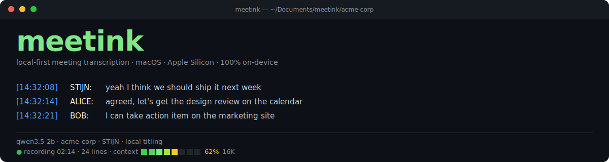

<p align="center">
  
</p>

# meetink

Local-first meeting transcription for the macOS terminal. Captures system audio (Zoom, Meet, Teams, anything that plays through the speakers) and your microphone simultaneously, runs them through `whisper.cpp` on-device, optionally identifies who is speaking, generates AI titles and summaries, and lets you ask questions about the meeting — all without sending a byte to the cloud.

> **Status:** v0.1.0 — Apple Silicon only. macOS 14 (Sonoma) or later.

```
[14:32:08] STIJN: yeah I think we should ship it next week
[14:32:14] ALICE: agreed, let's get the design review on the calendar
[14:32:21] BOB:   I can take action item on the marketing site
```

---

## Table of contents

- [Why](#why)
- [Highlights](#highlights)
- [Requirements](#requirements)
- [Install](#install)
- [Quick start](#quick-start)
- [The interactive REPL](#the-interactive-repl)
- [Slash commands reference](#slash-commands-reference)
- [Concepts](#concepts)
  - [Projects](#projects)
  - [Identity (`/me`)](#identity-me)
  - [Speaker identification (diarize + profiles)](#speaker-identification-diarize--profiles)
  - [Local LLM (titling, summaries, /ask)](#local-llm-titling-summaries-ask)
  - [Context documents](#context-documents)
  - [Custom vocabulary](#custom-vocabulary)
- [Examples & recipes](#examples--recipes)
- [How it works](#how-it-works)
- [File layout on disk](#file-layout-on-disk)
- [Configuration & environment variables](#configuration--environment-variables)
- [Troubleshooting](#troubleshooting)
- [Limitations](#limitations)
- [Privacy](#privacy)
- [License & credits](#license--credits)

---

## Why

If you take a lot of meetings on your Mac and want a private transcript, you usually have three options: pay a cloud notetaker (your audio leaves your laptop), record locally and transcribe later (slow, manual), or roll your own ScreenCaptureKit pipeline. meetink is the third one, packaged.

- **No cloud.** Audio never leaves your machine. No API key, no account.
- **Works everywhere.** It listens to system audio + microphone, so any video conferencing tool, dialler, or browser tab works the same way.
- **One command.** `meetink start` records, `meetink stop` stops. Or just type `meetink` and use the REPL.
- **Apple Silicon first.** Whisper runs on Metal. The local LLM runs on Apple's MLX framework (Metal + ANE), 30–60 % faster than llama.cpp on M-series.

---

## Highlights

- **Live, labelled transcripts.** Two streams (mic / system audio), aggressively de-hallucinated, merged into readable lines, written to a per-session file.
- **AI titles and summaries.** Finished meetings are renamed `2026-05-07_14-32_design-review-followup.txt`, and a `<name>.summary.md` (Topics, Decisions, Action items, Open questions) is generated automatically. Backend is `local` (on-device Qwen3.5-4bit via MLX) or `claude` (your Claude Pro/Max subscription via the `claude` CLI).
- **`/ask` over the meeting.** Stream answers about the current or most-recent transcript, with project context and prior `/ask` turns automatically threaded in.
- **Speaker identification.** Optional sidecar (sherpa-onnx + WeSpeaker) labels recurring voices by name once you've enrolled a `/profile`. Unknown voices get clustered live as `THEM-A`, `THEM-B`, …
- **Projects.** Group recordings, summaries, and reference docs by client / topic. `/ask` automatically pulls in past meetings and curated context for the active project.
- **Context documents.** `/context add report.pdf` converts any PDF / DOCX / XLSX / PPTX / MD into the project's reference set so the LLM can read it.
- **Native terminal UX.** `prompt_toolkit` REPL with tab completion, native scrollback, native text selection, native ⌘F. Live status footer with elapsed recording time and line count.

---

## Requirements

| | |
|---|---|
| **OS** | macOS 14 (Sonoma) or later |
| **CPU** | Apple Silicon (M1 / M2 / M3 / M4 …). Intel will not run the MLX features and is not supported. |
| **Disk** | ~2.2 GB for the default install (whisper `small.en` ~500 MB + Qwen3.5-2B-4bit ~1.2 GB + venv) |
| **Network** | Required for `setup` (downloads models). After that, fully offline unless you opt into the `claude` backend. |
| **Required tools** | Xcode Command Line Tools (`xcode-select --install`), [Homebrew](https://brew.sh), Python 3 (ships with macOS), [`uv`](https://github.com/astral-sh/uv) (auto-installed by `setup` if missing). |
| **Optional** | `claude` CLI (Claude Code) if you want the `claude` backend for titling / summaries / `/ask`. |

---

## Install

```sh
git clone https://github.com/sservaes/meetink.git
cd meetink
./bin/meetink setup
```

`setup` is idempotent and asks for a single confirmation up-front. It will:

1. Verify you're on Apple Silicon.
2. `brew install whisper-cpp` (or skip if already installed).
3. Download the whisper `small.en` GGML weights (~500 MB) and its CoreML companion (`.mlmodelc`) so the encoder runs on the Apple Neural Engine.
4. Build `meetink-capture` from `src/capture/Sources/main.swift` using the highest available `MacOSXNN.NN.sdk`, target `arm64-apple-macosx14.0`.
5. Provision a Python venv at `~/.meetink/py-venv` via `uv` and install `prompt_toolkit`, `mlx-lm`, `huggingface_hub`, `markitdown`.
6. Snapshot the default local LLM (`mlx-community/Qwen3.5-2B-4bit`, ~1.2 GB) into `~/.meetink/models/mlx/Qwen3.5-2B-4bit/`.

Total install size on disk after `setup`: ~2.2 GB.

Optionally add the launcher to your `PATH`:

```sh
ln -s "$(pwd)/bin/meetink" /usr/local/bin/meetink
```

### Permissions

The first `meetink start` will surface two macOS permission prompts. **Both attach to the terminal app you launched from, not to `meetink` itself.** If you switch terminals (Terminal.app → iTerm2 → Ghostty) you have to re-grant.

1. **Screen & System Audio Recording** — required to capture the audio of your call (the other people). Grant in *System Settings → Privacy & Security → Screen & System Audio Recording*.
2. **Microphone** — required to capture your voice.

See [`docs/permissions.md`](docs/permissions.md) for the full walkthrough including how to revoke.

---

## Quick start

```sh
# 1. Tell meetink who you are (one-time)
meetink           # opens the REPL
> /me Stijn       # transcripts will label your mic stream STIJN: instead of ME:

# 2. Start a meeting
> /start          # opens a separate "tail" window so you can see live captions
                   # while the REPL stays open for commands

# 3. … your meeting happens here, audio is captured + transcribed in real time …

# 4. End the meeting
> /stop           # stops capture + whisper-server
                   # auto-titles the transcript: 2026-05-07_14-32_<slug>.txt
                   # auto-generates <slug>.summary.md
                   # rebuilds <project>/meetings.md

# 5. Ask questions about it
> /ask what action items did we agree on?
> /ask did Alice say anything about pricing?
> /ask compared to last week, did we ship faster or slower?   # uses past meetings

# 6. (Optional) Group meetings into a project
> /project use acme-corp
> /context add ~/Downloads/acme-q2-roadmap.pdf
> /ask how does today's call line up with the Q2 roadmap?
```

You can also use it as a plain CLI without entering the REPL:

```sh
meetink start
# (run your meeting)
meetink stop
meetink tail            # opens a new Terminal window tailing live.txt
meetink status          # is it running? how many lines so far?
meetink transcripts     # ls the active project's transcripts dir
```

---

## The interactive REPL

Run `meetink` with no arguments at a TTY to drop into the REPL:

```
┌──────────────────────────────────────────────────────────────────────┐
│ meetink v0.1.0                                                       │
│                                                                      │
│ Active project:    acme-corp                                         │
│ You:               STIJN                                             │
│ Whisper model:     small.en (CoreML)                                 │
│ Local LLM:         qwen3.5-2b (resident)                             │
│ Titling backend:   local                                             │
│ Speaker ID:        on (3 profiles enrolled)                          │
│ Recording:         ● 02:14 · 24 lines                                │
└──────────────────────────────────────────────────────────────────────┘

> _
🎙 qwen3.5-2b │ 📁 acme-corp │ 👤 STIJN │ ✨ local titling │ 🧠 32GB · 14.3GB free
● recording 02:14 │ 24 lines │ context ▰▰▰▰▰▱▱▱ 62% 16K
```

- **Tab completion** — start typing `/` and hit Tab. Fuzzy completion on subcommands and (where it makes sense) on names: profile names, project names, attached context docs.
- **Native scroll & selection** — wheel scroll, click-and-drag select, ⌘C, ⌘F all work because the REPL runs *inline* (not in alt-screen mode). The footer scrolls with content; scroll back to the prompt to see the live status.
- **Streaming `/ask`** — answers stream token-by-token while the prompt stays usable. `/clear` clears the screen *and* drops the in-session `/ask` thread.
- **Live context-bar** — the `context ▰▰▰▰▰▱▱▱ 62% 16K` chip on the bottom row shows how much of the active backend's token budget the next `/ask` will consume (transcript + Q&A history). Green → yellow → red as the meeting grows. Budget label adapts to whichever backend is active: `8K` / `16K` / `32K` for the local Qwen quants, `200K` for Sonnet/Opus/Haiku, `1M` for the `[1m]`-extended Claude variants.
- **Slash command dispatch** — every slash command shells out to `bin/meetink <subcmd>` for stateful work; the REPL only owns the UI and the resident MLX model.

---

## Slash commands reference

All commands work both inside the REPL (`> /start`) and as CLI subcommands (`meetink start`). The reverse is not always true — bare CLI doesn't autocomplete and doesn't have a status footer.

### Recording

| Command | Description |
|---|---|
| `/start` | Begin recording mic + system audio. Spawns `whisper-server` and `meetink-capture`, opens a tail window. |
| `/stop` | Stop the capture binary and `whisper-server`. Auto-titles the file, generates `<name>.summary.md`, rebuilds `<project>/meetings.md`. |
| `/status` | Whether recording is active, plus the current line count of `live.txt`. |
| `/tail` | Open or raise a separate Terminal.app window tailing `live.txt`. |
| `/transcripts`, `/ls` | List transcripts in the active project's directory. |

### Identity

| Command | Description |
|---|---|
| `/me` | Show your current name. |
| `/me <name>` | Set it. From the next `/start`, mic-stream lines will be labelled `<NAME>:` (uppercased). Persisted in `~/.meetink/config`. |
| `/me clear` | Unset (back to `ME:`). |

### Projects

| Command | Description |
|---|---|
| `/project` | List all projects. |
| `/project use <name>` | Activate (creates the folder if new). All `/start` recordings, summaries, `meetings.md`, and `_context/` go into that subdirectory of `~/Documents/meetink/`. |
| `/project clear` | Go back to the top-level "default" project. |
| `/project rm <name>` | Delete a project directory. |

### Speaker identification

| Command | Description |
|---|---|
| `/diarize` | Show whether the diarize-server is installed/running. |
| `/diarize install` | Provision `~/.meetink/diarize-venv`, download the WeSpeaker ResNet34 ONNX model (~25 MB). |
| `/diarize on` / `off` | Enable / disable speaker ID for future recordings. Install is preserved across `off`. |
| `/diarize start` / `stop` | Manually start/stop the sidecar (normally handled by `/start` and `/stop`). |
| `/diarize rm` | Uninstall (deletes venv + model). |

### Voice profiles

| Command | Description |
|---|---|
| `/profile` / `/profile list` | Show enrolled people. |
| `/profile add <name>` | Record 3 × 5-second voice samples and persist a centroid as `<name>.npz`. The diarize-server must be running. |
| `/profile train <name>` | Add another sample to sharpen the centroid. |
| `/profile rm <name>` | Delete a profile. |
| `/profile clusters` | Show the live "unknown" voice clusters (`THEM-A`, `THEM-B`, …) the current session has accumulated. |
| `/profile assign <letter> <name>` | Convert a live cluster into a real profile **and** rewrite past lines in the current transcript: `THEM-A` → `ALICE`. |
| `/profile merge <from> <into>` | Fold one cluster into another. Useful when one voice gets split across two clusters by background noise. |

### Whisper models

| Command | Description |
|---|---|
| `/model` | List all whisper models in the registry, with size, description, and presence on disk. |
| `/model use <name>` | Switch the active model. Restarts `whisper-server` if currently recording. |
| `/model download <name>` | Fetch the GGML weights + CoreML companion. |
| `/model rm <name>` | Delete weights and CoreML dir. |

The registry covers `tiny.en`, `base.en`, `small.en` (default), `small.en-tdrz`, `medium.en`, `medium.en-tdrz`, `large-v3-turbo`, `large-v3`. The `*-tdrz` variants emit speaker-turn markers for the cluster fallback (`THEM-A` / `THEM-B` / …) when the diarize-server isn't running.

### Local LLM (titling / summary / `/ask`)

| Command | Description |
|---|---|
| `/llm` | Show backend, active model, install state. |
| `/llm install` | Provision `~/.meetink/py-venv` with `mlx-lm` and snapshot the default model. |
| `/llm list` | Show all registered MLX models with disk sizes and runtime memory estimates. |
| `/llm download <name>` | Snapshot a model into `~/.meetink/models/mlx/<dir>/`. Includes the `chat_template.jinja` HF moved out of `tokenizer_config.json` in 2025. |
| `/llm use <name>` | Switch the active model (used by titling, summaries, and `/ask`). |
| `/llm rm <name>` | Delete a snapshot. |
| `/llm backend` | Show the current backend. |
| `/llm backend local` | On-device Qwen3.5-*-4bit via MLX. Default. |
| `/llm backend claude` | Use `claude -p` (Claude Code in headless mode). Bills against your Claude Pro/Max subscription — no API key. |
| `/llm model <name>` | When `backend=claude`, pin the Claude model (`sonnet` / `haiku` / `opus` / a full id like `claude-sonnet-4-6`). |

The local model registry:

| Name | Size on disk | Runtime ~RAM | Use |
|---|---|---|---|
| `qwen3.5-0.8b` | 508 MB | ~900 MB | Titles only. Too small for `/ask`. |
| `qwen3.5-2b` | 1.2 GB | ~1.9 GB | **Default.** Better titles. Basic `/ask` on short meetings. |
| `qwen3.5-4b` | 2.6 GB | ~4.0 GB | Viable `/ask` on hour-long meetings. |
| `qwen3.5-9b` | 5.4 GB | ~7.5 GB | Best local `/ask` quality. |

`/ask` uses a model-aware token budget (8K / 16K / 16K / 32K) and falls back from full-doc context → per-doc summaries → no past meetings if the prompt would overflow.

### Asking questions

| Command | Description |
|---|---|
| `/ask <question>` | Ask the active backend about the current or most-recent transcript. The prompt automatically includes: your name (from `/me`), the active project, attached context docs (or their summaries if budget is tight), recency-tiered past meetings (`meetings.md`), the transcript itself, and prior `/ask` turns from this session. |

In-session conversation thread: up to 5 prior Q&A pairs are kept in the resident MLX runtime so you can ask follow-ups without re-stating context. `/clear` resets the thread.

### Context documents

| Command | Description |
|---|---|
| `/context` | List attached docs in the active project (with token counts). |
| `/context add <file>` | Convert a PDF / DOCX / XLSX / PPTX / HTML / MD / TXT into `<project>/_context/<name>.md` via `markitdown`, then generate `<name>.summary.md` for the budget-fallback path. Short docs skip the summary. |
| `/context rm <name>` | Delete both the `.md` and the `.summary.md`. |
| `/context show <name>` | Print the converted markdown. |

### Setup & misc

| Command | Description |
|---|---|
| `/setup` | Run the full installer (whisper, model, capture binary, venv, default LLM). Idempotent. |
| `/prompt`, `/vocab` | Open `~/.meetink/prompts/default.txt` in TextEdit to edit your custom whisper vocabulary. |
| `/clear` | Clear screen + scrollback **and** drop the in-session `/ask` thread. |
| `/help`, `/h`, `/?` | Show the full slash-command list. |
| `/quit`, `/exit`, `/q` | Exit the REPL. Active recordings keep running. |

---

## Concepts

### Projects

A project is a subdirectory of `~/Documents/meetink/` (overridable via `MEETINK_TRANSCRIPTS_DIR`). When a project is active:

- `/start` writes the new transcript into `<base>/<project>/`.
- `live.txt` symlinks to the active session inside that folder.
- Summaries (`<name>.summary.md`) and the rolling project digest (`meetings.md`) are written into the project folder.
- `_context/` (the docs you `/context add`) is per-project.
- `/ask` automatically loads the project's `meetings.md` + `_context/` into the prompt.

No active project = top-level files are the implicit "default" project.

```
~/Documents/meetink/
├── 2026-04-02_*.txt              ← default-project transcripts
├── meetings.md                   ← default-project rolling digest
└── acme-corp/
    ├── 2026-05-07_14-32_design-review-followup.txt
    ├── 2026-05-07_14-32_design-review-followup.summary.md
    ├── 2026-05-07_14-32_design-review-followup.txt.On   ← post-titling label snapshot
    ├── meetings.md               ← rolling digest, newest first, last 50 entries
    ├── live.txt                  ← symlink to the active recording
    └── _context/
        ├── acme-q2-roadmap.md
        ├── acme-q2-roadmap.summary.md
        └── pricing-tiers.md
```

### Identity (`/me`)

`/me Stijn` does two things:

1. Sets `MEETINK_ME_NAME=Stijn` for the next `meetink-capture` invocation. The capture binary uppercases it and labels the mic stream `STIJN:` everywhere it would otherwise have written `ME:`.
2. Embeds `# user: Stijn` in the transcript header, so post-hoc tooling (titling, `/ask`, future rewrites) can resolve who the mic-stream speaker is.

Persisted in `~/.meetink/config` as `me_name=Stijn`.

### Speaker identification (diarize + profiles)

By default, system-audio lines are labelled `THEM:`. With `/diarize on` and a profile-equipped sidecar, you get per-line speaker decisions:

- **Enrolled profile match.** Each `/profile add <name>` records 3 × 5 s samples, embeds them via WeSpeaker, L2-normalises, averages into a centroid, persists as `<name>.npz`. At identify time, the top profile must clear cosine ≥ 0.65 *and* beat the runner-up by ≥ 0.07 — otherwise we don't claim a match.
- **Online clustering fallback.** Unknown embeddings are grouped into in-memory clusters and labelled `THEM-A`, `THEM-B`, … so the live transcript still distinguishes voices. Cluster state is per-session (cleared on `/start`).
- **Recovery.** After the meeting, `/profile assign A Alice` converts cluster A into a real profile *and* rewrites past `THEM-A` lines to `ALICE` in the transcript file. `/profile merge A B` folds two clusters together if one voice got split.

Per-chunk diarization: each ~3 s WAV chunk is identified individually (synchronous, ~300 ms via the local sidecar) before the line is written, so the labels you see live are the same labels in the final file.

### Local LLM (titling, summaries, /ask)

The local backend is Apple's MLX framework with `mlx-community/Qwen3.5-*-4bit` snapshots. Three reasons it matters:

1. **Speed.** 30–60 % faster than llama.cpp on Apple Silicon (Metal + ANE + unified memory).
2. **Resident model.** `MLXRuntime` holds the model in unified memory across `/ask` calls. Cold start ~3 s; subsequent `/ask` < 1 s. After 5 minutes idle the model is released so the RAM is reclaimable.
3. **Conversation thread.** Up to 5 prior Q&A pairs are folded into the next `/ask` prompt automatically. `/clear` resets the thread.

Titling and per-meeting summaries run on the same backend on `/stop`.

When you switch to `claude` backend (`/llm backend claude`), titling / summary / `/ask` shell out to `claude -p` (Claude Code in headless mode). No API key — it bills against your existing Claude Pro/Max subscription. Network is required, and answers are slightly higher quality but ~15–20 s slower than the local resident path.

### Context documents

`/context add report.pdf` runs the file through Microsoft's `markitdown` (covers PDF, DOCX, XLSX, PPTX, HTML, MD, TXT, EPUB, images via OCR), writes the markdown to `<project>/_context/<name>.md`, and — for docs over the `CONTEXT_SUMMARY_THRESHOLD` (~800 tokens) — generates a structured `<name>.summary.md` via the active backend.

`/ask` consumes them automatically:

- **Local backend:** tries the full markdown first; if the prompt overshoots the model's token budget, falls back to summaries; if still over, drops past-meetings; finally warns if even the most-compact strategy overflows.
- **Claude backend:** always uses the full markdown.

### Custom vocabulary

Whisper does noticeably better when you prime it with the jargon and proper nouns it should expect. Edit `~/.meetink/prompts/default.txt` (or use `/prompt` to open it in TextEdit). Comma-separated names, acronyms, product names work well. The default file ships **empty** to avoid prompt leakage where whisper regurgitates the prompt during silence.

Example template at `src/capture/prompts/example.txt`.

---

## Examples & recipes

### A simple solo dictation session

```sh
meetink start
# … speak …
meetink stop
meetink transcripts
```

The mic stream gets labelled `ME:` (or `<your name>:` if you've set `/me`). System-audio lines fire only when something is actually playing, so a silent tab won't pollute the transcript.

### A weekly recurring meeting in a project

```sh
meetink
> /me Stijn
> /project use acme-corp
> /diarize install        # one-time
> /diarize on
> /profile add Alice      # one-time, with Alice present
> /profile add Bob

# every week:
> /start
# … meeting …
> /stop
> /ask what was different from last week?
> /ask did anyone follow up on the action items from week 3?
```

Each `/stop` rebuilds `acme-corp/meetings.md` from the per-meeting summaries (newest first, capped at 50 entries via `MEETINK_MEETINGS_LOG_KEEP`). `/ask` automatically tier-slices it: full content for the most recent 3 entries, condensed for entries 4–10, heading-only for 11–30, dropped after that.

### Adding a pre-read to the project

```sh
> /project use acme-corp
> /context add ~/Downloads/acme-q2-roadmap.pdf
> /context add ~/Downloads/pricing-tiers.xlsx
> /context list

# in the next meeting:
> /start
# …
> /stop
> /ask how does what we just discussed line up with the Q2 roadmap?
```

PDF/DOCX/XLSX/etc. → markdown via `markitdown`. The summary is generated by whichever backend is active; if Qwen is too small for the doc, switch to a bigger local model (`/llm use qwen3.5-4b`) or to claude (`/llm backend claude`) just for the conversion, then switch back.

### Interactive `/ask` follow-ups

```
> /ask what action items did we agree on?
1. Stijn: prepare the design review deck for next Tuesday.
2. Alice: send the updated pricing tiers to Bob by Friday.
3. Bob: book the marketing-site review.

> /ask who has the most on their plate?
Alice. She owns the pricing-tiers update *and* needs to attend the
design review you mentioned earlier.

> /ask draft me a slack message to her summarising both
Hi Alice — quick recap of today: please send Bob the updated pricing
tiers by Fri, and join Tuesday's design review (Stijn is presenting).
Anything you need from me?
```

The follow-up sees the prior turn — `MLXRuntime.add_ask_pair` records each completed `(question, answer)` pair (cap 5) and `_build_ask_prompt` injects them under "Earlier in this conversation" before the next question.

`/clear` drops the thread.

### Switching to claude for higher-quality answers on a long call

```
> /llm backend claude
✓ Backend set to claude (model: claude-sonnet-4-6)

> /ask summarise the full meeting in 5 bullet points

> /llm backend local        # back to on-device when you're done
```

### Recovering speakers after the fact

```
> /stop
# transcript has THEM-A, THEM-B, THEM-C lines
> /profile clusters
  A   12 utterances, last seen 14:31:08
  B   24 utterances, last seen 14:32:14
  C    3 utterances, last seen 14:28:42

> /profile assign A Alice
✓ Renamed THEM-A → ALICE in 2026-05-07_14-32_design-review-followup.txt

> /profile assign B Bob
> /profile merge C B        # C was Bob with background noise
```

### Tail in a separate window while you work

```
> /start                 # auto-opens a tail window
> /tail                  # raise it again if it got buried
# … do other things in the REPL …
> /stop                  # auto-closes the tail window
```

---

## How it works

```
┌──────────────────────┐   ┌─────────────────────────┐   ┌───────────────────────┐
│ ScreenCaptureKit     │──▶│ meetink-capture (Swift) │──▶│ whisper-server        │
│ + AVAudioEngine      │   │ • 16 kHz mono           │   │ (whisper.cpp + Metal  │
│                      │   │ • 3-sec chunks          │   │  + CoreML/ANE)        │
└──────────────────────┘   │ • mic = ME / <NAME>     │   │  :8178 /inference     │
                           │ • sys = THEM (or        │   └───────────────────────┘
                           │   diarize-identified)   │              │
                           │ • POST WAV per chunk    │              ▼
                           └─────────────────────────┘   ┌───────────────────────┐
                                       │                  │ Hallucination filter  │
                                       │                  │ + TranscriptMerger    │
                                       ▼                  └───────────────────────┘
                           ┌─────────────────────────┐              │
                           │ diarize-server (sherpa- │◀── /identify │
                           │ onnx WeSpeaker, CoreML) │   per chunk  ▼
                           │ :8179                   │   ┌─────────────────────┐
                           └─────────────────────────┘   │ live.txt (append)   │
                                                          └─────────────────────┘
                                                                    │
                                                                    ▼ on /stop
                                                          ┌─────────────────────┐
                                                          │ MLX runtime (Qwen)  │
                                                          │ • title slug        │
                                                          │ • summary.md        │
                                                          │ • meetings.md       │
                                                          └─────────────────────┘
                                                                    │
                                                                    ▼ on /ask
                                                          ┌─────────────────────┐
                                                          │ Resident MLX runtime│
                                                          │ • streamed answer   │
                                                          │ • Q&A thread (5)    │
                                                          └─────────────────────┘
```

- **Capture** (`src/capture/Sources/main.swift`). Swift binary, ScreenCaptureKit for system audio, AVAudioEngine for mic. Mixed to 16 kHz mono; both streams chunked every 3 s. Per-chunk POSTs to `whisper-server` include the user's vocabulary file *plus* a 200-char rolling per-speaker context for better continuity.
- **Transcription**. `whisper-server` (Homebrew `whisper-cpp`) runs locally on `127.0.0.1:8178` with the chosen model loaded once. The CoreML companion runs the encoder on the Apple Neural Engine.
- **Hallucination filter**. Drops common whisper artefacts: `(soft music)`, `[typing]`, "thanks for watching", repetition loops, copyright strings, anything fully parenthesised or bracketed under 40 chars, and prompt-leakage phrases.
- **TranscriptMerger**. Coalesces back-to-back same-speaker chunks (2 s gap or 5 s buffer max) so one user utterance is one transcript line, not ten.
- **Diarization** (optional, `src/diarize/server.py`). Python sidecar on `:8179`. WeSpeaker ResNet34 ONNX (CoreML-accelerated) embeds each ~3 s WAV. Two-stage `/identify`: enrolled-profile match → online cluster fallback. State is per-session.
- **Titling + summaries** (`src/llm/mlx_helper.py`, `src/lib/summary.sh`). On `/stop`, the active backend produces a 3–5 word slug for the filename and a structured 4-section summary (Topics, Decisions, Action items, Open questions). The project-level `meetings.md` is rebuilt from the summary set so it's always in sync.
- **/ask** (`src/repl/repl.py`, `src/llm/mlx_runtime.py`). In-process MLX singleton. Token-aware prompt assembly with three escalating fallback strategies. Streamed token output via `print_formatted_text(ANSI(...))` + `patch_stdout`, so the bottom-toolbar footer keeps rendering through the answer.

---

## File layout on disk

```
~/.meetink/                       ($MEETINK_HOME, internal state)
├── bin/
│   └── meetink-capture           Swift binary built by /setup
├── models/
│   ├── ggml-small.en.bin         Whisper GGML weights
│   ├── ggml-small.en.mlmodelc/   CoreML companion (ANE-accelerated encoder)
│   ├── speaker-embedding.onnx    WeSpeaker (~25 MB)
│   └── mlx/
│       └── Qwen3.5-2B-4bit/      MLX snapshot (config.json, *.safetensors,
│                                  tokenizer*, chat_template.jinja, …)
├── prompts/
│   └── default.txt               Custom whisper vocabulary
├── profiles/
│   ├── alice.npz                 Voice profile (centroid + sample count)
│   └── bob.npz
├── py-venv/                      Project venv (mlx-lm, prompt_toolkit, …)
├── diarize-venv/                 Diarize sidecar venv (sherpa-onnx, numpy)
└── config                        key=value settings
                                   me_name=Stijn
                                   active_project=acme-corp
                                   local_llm_model=qwen3.5-2b
                                   title_backend=local
                                   diarize_enabled=true
                                   ...

~/Documents/meetink/              ($MEETINK_TRANSCRIPTS_DIR, your data)
├── 2026-04-02_09-00.txt          Default-project transcript
├── meetings.md                   Default-project rolling digest
├── live.txt                      Symlink to the active recording
└── acme-corp/
    ├── 2026-05-07_14-32_design-review-followup.txt
    ├── 2026-05-07_14-32_design-review-followup.summary.md
    ├── meetings.md
    ├── live.txt
    └── _context/
        ├── acme-q2-roadmap.md
        └── acme-q2-roadmap.summary.md

/tmp/
├── meetink-capture.pid           Capture-binary PID
├── meetink-whisper.pid           whisper-server PID
├── meetink-diarize.pid           diarize-server PID
├── meetink-tail.tailpid          tail-window helper PID
├── meetink-whisper.log
├── meetink-capture.log
├── meetink-diarize.log
└── meetink-chunks/               Ephemeral per-chunk WAVs (auto-cleaned)
```

Transcripts default to `~/Documents/meetink/` because they're your data — they live with your other documents (and get backed up by Time Machine / iCloud if you've set that up). Internal state (binaries, models, venvs, PIDs, logs) lives in `~/.meetink/`.

---

## Configuration & environment variables

`meetink` is configured by three things, in this order of precedence:

1. **Environment variables** (highest)
2. **`~/.meetink/config`** (managed by `/me`, `/project use`, `/llm backend`, etc. — but you can edit it directly)
3. **Defaults**

### Paths

| Variable | Default | What it controls |
|---|---|---|
| `MEETINK_HOME` | `~/.meetink` | Internal state directory. |
| `MEETINK_TRANSCRIPTS_DIR` | `~/Documents/meetink` | Where transcripts go. Project subdirectories live here. |
| `MEETINK_TRANSCRIPT` | `$MEETINK_TRANSCRIPTS_DIR/live.txt` | Symlink path for the active recording. |
| `MEETINK_MODEL` | `$MEETINK_HOME/models/ggml-small.en.bin` | Whisper model the capture binary asks `whisper-server` to use. |
| `MEETINK_PROMPT` | `$MEETINK_HOME/prompts/default.txt` | Custom whisper vocabulary. |
| `MEETINK_CHUNK_DIR` | `/tmp/meetink-chunks` | Where per-chunk WAVs are staged before POSTing. |
| `MEETINK_PROFILES_DIR` | `$MEETINK_HOME/profiles` | Voice-profile `.npz` files. |
| `MEETINK_DIARIZE_PORT` | `8179` | Diarize sidecar port. |
| `MEETINK_LLM_MODEL` | resolved from registry | Path to the local MLX snapshot. Override to point at any locally available MLX-format model. |

### Behaviour

| Variable | Default | What it controls |
|---|---|---|
| `MEETINK_ME_NAME` | unset | Mic-stream label override. Normally set by `/me` via the launcher. |
| `MEETINK_TITLE_BACKEND` | `local` | `local` or `claude`. Wins over `~/.meetink/config`. |
| `MEETINK_CLAUDE_MODEL` | `claude-sonnet-4-6` | Which Claude model to use when backend is `claude`. |
| `MEETINK_MEETINGS_LOG_KEEP` | `50` | Cap on entries in `<project>/meetings.md`. |
| `MEETINK_CONTEXT_SUMMARY_THRESHOLD` | `800` | Skip summarising context docs shorter than this many tokens. |

### `~/.meetink/config` keys

`key=value` per line. Managed by slash commands but human-editable.

```
me_name=Stijn
active_project=acme-corp
active_model=small.en
local_llm_model=qwen3.5-2b
title_backend=local
claude_model=claude-sonnet-4-6
diarize_enabled=true
```

---

## Troubleshooting

**"unknown subcommand" or `meetink: command not found`.** Make sure the launcher is on `PATH` (`ln -s "$(pwd)/bin/meetink" /usr/local/bin/meetink`). The launcher is zsh-only — it uses zsh-isms like `${0:A}`, `${name:h}`, `typeset -gA`. Don't run it under bash.

**Permissions: capture binary fails immediately.** Check *System Settings → Privacy & Security → Screen & System Audio Recording* and *Microphone*. Both have to be granted to whichever **terminal app** you're launching from (Terminal.app, iTerm2, Ghostty, Warp), not to `meetink` itself. Switching terminals requires re-granting. See `docs/permissions.md`.

**`whisper-server` won't start, port `:8178` already in use.** Something else on your machine is running `whisper-cpp`. Stop it, or change the port: `MEETINK_PORT=8198 meetink start` *(the launcher binds the same port for the capture binary, so they have to agree)*.

**`/llm` says "model snapshot is missing chat_template.jinja".** HuggingFace moved chat templates from `tokenizer_config.json` into a sibling `chat_template.jinja` file in 2025. Older snapshots predate the fix. Run `/llm rm <name>` then `/llm download <name>` — the downloader includes `*.jinja` in its allow-list.

**`/ask` is slow on the first call but fast on subsequent ones.** Cold-start: the MLX runtime loads the model (~2–3 s for 2B, ~7 s for 4B). Subsequent `/ask` calls hit the resident model in <1 s. After 5 minutes idle the model is released and the next call cold-starts again. Trade-off: keep the model resident vs. give the unified memory back.

**`/ask` answer warns "prompt is XK tokens but budget is YK".** Even the most-compact strategy (summaries only, no past meetings) overshoots the active model's window. Either switch to a bigger model (`/llm use qwen3.5-4b` or `qwen3.5-9b`), or to claude (`/llm backend claude`).

**The transcript is full of noise / `(soft music)` / "thanks for watching".** Whisper hallucinations during quiet stretches. The hallucination filter is opinionated; if a real utterance gets eaten, look at `isHallucination` in `src/capture/Sources/main.swift`. If the hallucinations leak through, try a bigger model (`/model use small.en` → `medium.en`) and add the offending phrase to `~/.meetink/prompts/default.txt` — it biases whisper toward the prompt.

**Two install locations for the binary.** `/setup` builds and copies to `~/.meetink/bin/meetink-capture`. The source-tree copy at `src/capture/meetink-capture` is gitignored and only used as a fallback. After editing `main.swift` you have to either re-run `/setup` or copy the new binary into `~/.meetink/bin/` — `/start` won't auto-rebuild if the old binary still exists.

**Bracket `[ ]` artefacts on prompt lines.** Known cosmetic issue tracked separately. If you can reproduce it, please attach the raw output from `script -q /tmp/meetink-session.log meetink` so the byte sequence can be diagnosed.

### Where to look when something fails silently

```sh
tail -f /tmp/meetink-whisper.log    # whisper-server output
tail -f /tmp/meetink-capture.log    # capture-binary stderr
tail -f /tmp/meetink-diarize.log    # diarize-server output
ls -la /tmp/meetink-*.pid           # what we think is running
```

---

## Limitations

- **macOS only.** ScreenCaptureKit and AVAudioEngine are macOS-specific. No Linux or Windows port planned.
- **Apple Silicon required for the LLM features.** Titling, summaries, and `/ask` use MLX, which is Apple-Silicon only. Whisper alone might work on Intel Macs but is untested.
- **English-first.** The default whisper model is `small.en`. For multilingual calls, switch to `large-v3-turbo` or `large-v3` via `/model use`.
- **Single mic input.** `meetink-capture` uses the system default microphone. If you have multiple mics (e.g., USB interface + built-in), set the default via *System Settings → Sound* before `/start`.
- **System audio = whatever's playing through speakers.** If you AirPlay your meeting to another device, the system audio capture won't see it.
- **No live diarization for the mic stream.** The mic always belongs to whoever is running `meetink`, so we don't run it through the embedder — we just label it `ME` (or `<NAME>:` from `/me`).

---

## Privacy

- **Audio never leaves your machine** unless you explicitly switch the LLM backend to `claude`, in which case the transcript text (not the audio) is sent to Anthropic via the `claude` CLI. The default backend is `local` — fully offline.
- **No telemetry.** meetink doesn't phone home. The only outbound network calls are: model downloads from huggingface.co / GitHub releases on `/setup`, and `claude -p` if you've opted into that backend.
- **Transcripts are plain text on disk.** They live wherever you point `MEETINK_TRANSCRIPTS_DIR`. By default that's `~/Documents/meetink/`, which iCloud Drive and Time Machine will back up if you've set those up. Move it elsewhere if you don't want that.
- **Voice profiles** (`~/.meetink/profiles/*.npz`) are L2-normalised embedding centroids — *not* recoverable audio. Delete them with `/profile rm <name>` or `rm`.

---

## License & credits

MIT — see [LICENSE](LICENSE).

Built on top of:

- [whisper.cpp](https://github.com/ggerganov/whisper.cpp) — Georgi Gerganov
- Apple's [ScreenCaptureKit](https://developer.apple.com/documentation/screencapturekit), [AVAudioEngine](https://developer.apple.com/documentation/avfaudio/avaudioengine), and [MLX](https://github.com/ml-explore/mlx)
- [sherpa-onnx](https://github.com/k2-fsa/sherpa-onnx) + [WeSpeaker](https://github.com/wenet-e2e/wespeaker) for speaker embedding
- [Qwen3.5](https://huggingface.co/collections/Qwen/qwen35) — Alibaba (4-bit MLX quants by [mlx-community](https://huggingface.co/mlx-community))
- [prompt_toolkit](https://github.com/prompt-toolkit/python-prompt-toolkit), [markitdown](https://github.com/microsoft/markitdown), [uv](https://github.com/astral-sh/uv)
- [Claude Code](https://claude.com/code) — the optional `claude` backend
